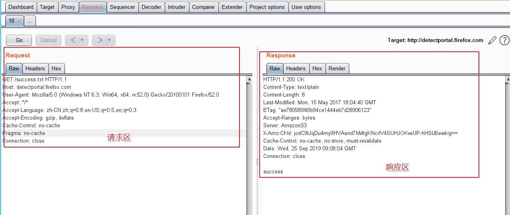

# [Burp Suite](https://portswigger.net/) 小记

---

## 免责声明

`本人撰写的手册,仅供学习和研究使用,请勿使用文中的技术源码用于非法用途,任何人造成的任何负面影响,与本人无关。`

---

## Reference
- [kali 安装新版本burp 以及不能使用重新安装jdk的解决方法](https://blog.csdn.net/nzjdsds/article/details/81205184)
- [Burp Suite 实战指南](https://t0data.gitbooks.io/burpsuite/)

---

## 安装
**windows**

略

**linux**

这里以 kali 举例，kali 自带的是 openjdk 不支持新版 burp，自行下载 [oracle jdk](https://www.oracle.com/technetwork/java/javase/downloads/jdk8-downloads-2133151.html)

安装过程见 [Power-Linux](../../运维/Linux/Power-Linux.md##JDK)

没问题就直接运行即可 `java -jar <burp文件名>.jar
`

---

## 配置
**证书**

- **firefox**

    浏览器访问 burp/ ,下载 cacert.der 证书，一路下一步安装，证书存储选择存储在 `受信任的根证书颁发机构`，firefox 需要到 隐私与安全->证书->查看证书->导入->全部勾选信任

---

## Target

---

## Proxy

---

## Repeater 中继模块

Burp Repeater 作为 Burp Suite 中一款手工验证 HTTP 消息的测试工具，通常用于多次重放请求响应和手工修改请求消息的修改后对服务器端响应的消息分析。

请求消息区为客户端发送的请求消息的详细信息，Burp Repeater 为每一个请求都做了请求编号，当我们在请求编码的数字上双击之后，可以修改请求的名字，这是为了方便多个请求消息时，做备注或区分用的。在编号的下方，有一个【GO】按钮，当我们对请求的消息编辑完之后，点击此按钮即发送请求给服务器端。

---

## Sequencer

---

## Decoder

---

## Intruder 爆破模块

它的工作原理是：Intruder 在原始请求数据的基础上，通过修改各种请求参数，以获取不同的请求应答。每一次请求中，Intruder 通常会携带一个或多个有效攻击载荷（Payload),在不同的位置进行攻击重放，通过应答数据的比对分析来获得需要的特征数据。

**Target**

目标设定

**Positions**

确定要爆破的参数，爆破类型

- 狙击手模式（Sniper）——它使用一组 Payload 集合，依次替换 Payload 位置上（一次攻击只能使用一个 Payload 位置）被 § 标志的文本（而没有被 § 标志的文本将不受影响），对服务器端进行请求，通常用于测试请求参数是否存在漏洞。

- 攻城锤模式（Battering ram）——它使用单一的 Payload 集合，依次替换 Payload 位置上被 § 标志的文本（而没有被 § 标志的文本将不受影响），对服务器端进行请求，与狙击手模式的区别在于，如果有多个参数且都为 Payload 位置标志时，使用的 Payload 值是相同的，而狙击手模式只能使用一个 Payload 位置标志。

- 草叉模式（Pitchfork ）——它可以使用多组 Payload 集合，在每一个不同的 Payload 标志位置上（最多20个），遍历所有的 Payload。举例来说，如果有两个 Payload 标志位置，第一个 Payload 值为 A 和 B，第二个 Payload 值为 C 和 D，则发起攻击时，将共发起两次攻击，第一次使用的 Payload 分别为 A 和 C，第二次使用的 Payload 分别为 B 和 D。

- 集束炸弹模式（Cluster bomb） 它可以使用多组 Payload 集合，在每一个不同的 Payload 标志位置上（最多 20 个），依次遍历所有的 Payload。它与草叉模式的主要区别在于，执行的 Payload 数据 Payload 组的乘积。举例来说，如果有两个 Payload 标志位置，第一个 Payload 值为 A 和 B，第二个 Payload 值为 C 和 D，则发起攻击时，将共发起四次攻击，第一次使用的 Payload 分别为 A 和 C，第二次使用的 Payload 分别为 A 和 D，第三次使用的 Payload 分别为 B 和 C，第四次使用的 Payload 分别为 B 和 D。

**Payloads**

Payload Processing 配置加密规则,优先级由上往下,自动给字典编码

Payload Encoding 配置字典进行 URL 编码

**Options**

- 请求消息头设置（Request Headers）

    这个设置主要用来控制请求消息的头部信息，它由 Update Content-Length header和Set Connection: close两个选项组成。

    其中 Update Content-Length header 如果被选中，Burp Intruder 在每个请求添加或更新 Content-Length 头为该次请求的 HTTP 体的长度正确的值。这个功能通常是为插入可变长度的 Payload 到模板的 HTTP 请求的主体的攻击中，如果没有指定正确的值，则目标服务器可能会返回一个错误，可能会到一个不完整的请求做出响应，或者可能会无限期地等待请求继续接收数据。

    Set Connection: close 如果被选中，表示 Burp Intruder 在每个请求消息中添加或更新值为“关闭”的连接头，这将更迅速地执行。在某些情况下（当服务器本身并不返回一个有效的 Content-Length 或 Transfer-Encoding 头），选中此选项可能允许攻击。

- 请求引擎设置（Request Engine）

    这个设置主要用来控制 Burp Intruder 攻击，合理地使用这些参数能更加有效地完成攻击过程。它有如下参数：Number of threads 并发的线程数，Number of retries on network failure 网络失败时候重试次数，Pause before retry 重试前的暂停时间间隔（毫秒），Throttle between requests 请求延时（毫秒），Start time 开始时间，启动攻击之后多久才开始执行。

- 攻击结果设置（Attack Results）

    这个设置主要用来控制从攻击结果中抓取哪些信息。它的参数有：Store requests / responses 保存请求/应答消息，Make unmodified baseline request 记录请求母板的消息内容，Use denial-of-service mode 使用 Dos 方式，tore full payloads 存储所有的 Payload 值。

- Grep Match

    这个设置主要用来从响应消息中提取结果项，如果匹配，则在攻击结果中添加的新列中标明，便于排序和数据提取。比如说，在密码猜测攻击，扫描诸如“密码不正确”或“登录成功”，可以找到成功的登录;在测试 SQL 注入漏洞，扫描包含“ODBC”，“错误”等消息可以识别脆弱的参数。

    Match type 表示匹配表达式还是简单的字符串，Case sensitive match 是否大小写敏感，Exclude HTTP headers 匹配的时候，是否包含 http 消息头。

- Grep Extract

    这些设置可用于提取响应消息中的有用信息。对于列表中配置的每个项目，Burp 会增加包含提取该项目的文本的新结果列。然后，您可以排序此列（通过单击列标题）命令所提取的数据。此选项是从应用数据挖掘有用的，能够支持广泛的攻击。例如，如果你是通过一系列文档 ID 的循环，可以提取每个文档寻找有趣的项目的页面标题。如果您发现返回的其他应用程序用户详细信息的功能，可以通过用户 ID 重复和检索有关用户寻找管理帐户，甚至密码。如果“遗忘密码”的功能需要一个用户名作为参数，并返回一个用户配置的密码提示，您可以通过共同的用户名列表运行和收获的所有相关密码的提示，然后直观地浏览列表寻找容易被猜到密码。

- Grep Payloads

    这些设置可用于提取响应消息中是否包含 Payload 的值，比如说，你想验证反射性的 XSS 脚本是否成功，可以通过此设置此项。当此项设置后，会在响应的结果列表中，根据 Payload 组的数目，添加新的列，显示匹配的结果，你可以通过点击列标题对结果集进行排序和查找。

    其设置项跟上一个类似，需要注意的是 Match against pre-URL-encoded payloads，如果你在请求消息时配置了 URL-encode payloads ，则这里表示匹配未编码之前的 Payload 值，而不是转码后的值。

- 重定向（Redirections）

    这些设置主要是用来控制执行攻击时 Burp 如何处理重定向，在实际使用中往往是必须遵循重定向，才能实现你的攻击目的。例如，在密码猜测攻击，每次尝试的结果可能是密码错误会重定向响应到一个错误消息提示页面，如果密码正确会重定向到用户中心的首页。 但设置了重定向也可能会遇到其他的问题，比如说，在某些情况下，应用程序存储您的会话中初始请求的结果，并提供重定向响应时检索此值，这时可能有必要在重定向时只使用一个单线程攻击。也可能会遇到，当你设置重定向，应用程序响应会重定向到注销页面，这时候，按照重定向可能会导致您的会话被终止时。 因其设置选项跟其他模块的重定向设置基本一致，此处就不再重叙。

- **结果选项卡**

    可以使用过滤器进行筛选

---

## Comparer 差异比对模块

Burp Comparer 在 Burp Suite 中主要提供一个可视化的差异比对功能，来对比分析两次数据之间的区别。使用中的场景可能是：
1. 枚举用户名过程中，对比分析登陆成功和失败时，服务器端反馈结果的区别。
2. 使用 Intruder 进行攻击时，对于不同的服务器端响应，可以很快的分析出两次响应的区别在哪里。
3. 进行 SQL 注入的盲注测试时，比较两次响应消息的差异，判断响应结果与注入条件的关联关系。

对于 Comparer 的使用，主要有两个环节组成，先是数据加载，然后是差异分析。 Comparer 数据加载的方式常用的有：从其他 Burp 工具通过上下文菜单转发过来、直接粘贴、从文件加载三种方式。当加载完毕后，如果你选择了两次不同的请求或应答消息，则下放的比较按钮将被激活，可以选择文本比较或者字节比较。

如果点击了【words】或者【bytes】，则进入比对界面，页面自动通过背景颜色显示数据的差异。

其中，文本比较（words）是指通过文本的方式，比如说以 HTML 的方式，比较两个数据的差异；而字节比较（bytes）是指通过 16 进制的形式，比较两次内容的差异。

---

## Extender 插件模块

下载、管理 burp 的插件

官方插件商店 https://portswigger.net/bappstore

大部分插件运行需要 [Jython](https://www.jython.org/downloads.html)、[JRuby](https://www.jruby.org/download) 环境，需要在 Extender-->Options 中指定 jar 文件，或者直接安装

推荐的插件列表请见 [Power-PenTest](../Power-PenTest.md###[BurpSuite](https://portswigger.net/))
