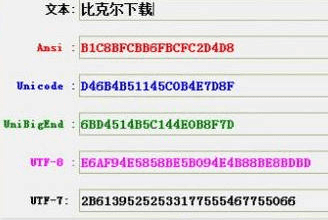

# 字符编码

---

# 基础知识

`这里归类一些基础知识`

**位 (bit)**

来自英文 bit,音译为"比特",表示二进制位.

位是计算机内部数据储存的最小单位,由一个 8 位二进制数组成.

**字节 (byte)**

字节来自英文 Byte,音译为"拜特",习惯上用大写的"B"表示.

字节是计算机中数据处理的基本单位.

计算机中以字节为单位存储和解释信息,规定一个字节由八个二进制位构成,即 1 个字节等于 8 个比特 (1Byte=8bit) .

**字**

计算机进行数据处理时,一次存取、加工和传送的数据长度称为字 (word) .一个字通常由一个或多个 (一般是字节的整数位) 字节构成.例如 286 微机的字由 2 个字节组成,它的字长为 16;486 微机的字由 4 个字节组成,它的字长为 32 位机.

**原码**

最高位为符号位,"0" 表示正,"1" 表示负,其余位表示数值的大小
```
X=+101011 , [X] 原 = 00101011    X=-101011 , [X] 原 = 10101011
```
位数不够的用 0 补全.

- 小数原码的定义
    ```
    X=+0.1011 , [X] 原 = 0.1011
    X=－0.1011 [X] 原 = 1.1011
    ```

**反码**

反码就是在原码的基础上,符号位不变其他位按位取反 (就是 0 变 1,1 变 0) 就可以了.
```
X=-101011 , [X] 原 = 10101011 ,[X] 反 = 11010100
```

**补码**

反码的基础上按照正常的加法运算加 1.
```
X=-101011 , [X] 原 = 10101011 ,[X] 反 = 11010100,[X] 补 =11010101
```
PS:0 的补码是唯一的,如果机器字长为 8 那么 [0] 补 = 00000000.


**移码**

不管正负数,只要将其补码的符号位取反即可.
```
X=-101011 , [X] 原 = 10101011 ,[X] 反 = 11010100,[X] 补 = 11010101,[X] 移 = 01010101
```

---

# 运算符

`这里以 C 的常用运算符为例`

**算数运算**
```C
+-*/    加、减、乘、除
%       取模运算    N=5,Y=N%3,Y=2
```

**逻辑运算**
```C
&&      逻辑与      A=TRUE,B=FALSE,C=A&&B,C=FALSE
||      逻辑或      A=TRUE,B=FALSE,C=A||B,C=TRUE
!       逻辑非      A=TRUE,B=!A,B=FALSE
```

**关系运算**
```C
>       大于        A=1,B=2,C=A>B,C=FALSE
<       小于        A=1,B=2,C=A<B,C=TRUE
>=      大于等于    A=2,B=2,C=A>=B,C=TRUE
<=      小于等于    A=2,B=2,C=A<=B,C=TRUE
==      等于        A=1,B=2,C=(A==B),C=FALSE
!=      不等于      A=1,B=2,C=(A!=B),C=TRUE
```

**位运算**
```C
~       按位取反    A=0b00001111,B=~A,B=0b11110000
<<      左移        A=0b00001111,A<<2=0b00111100
>>      右移        A=0b11110000,A>>2=0b00111100
&       按位与      A=0b1010,B=0b1000,A&B=0b1000
!       按位或      A=0b1010,B=0b1000,A!B=0b1010
^       按位异或    A=0b1010,B=0b1000,A^B=0b0010
```

**增量和减量运算**
```C
++      增量运算符  A=3,A++,A=4
--      减量运算符  A=3,A--,A=2
```

**复合赋值运算**
```C
+=      加法赋值    A=1,A+=2,A=3
-=      减法赋值    A=4,A-=4,A=0
>>=     右移位赋值  A=0b11110000,A>>=2,A=0b00111100
<<=     左移位赋值  A=0b00001111,A<<=2,A=0b00111100
*=      乘法赋值    A=2,A*=3,A=6
&=      按位与赋值  A=0b1010,A&=0b1000,A=0b1000
|=      按位或赋值  A=0b1010,A|=0b1000,A=0b1010
^=      按位异或赋值    A=0b1010,A^=0b1000,A=0b0010
%=      取模赋值    A=5,A%=2,A=1
/=      除法赋值    A=4,A/=2,A=2
```

**指针和地址运算**
```C
*       取内容  A=*P
&       取地址  A=&P
```

**输出格式转换**
```
0x      无符号十六进制数    0xa=0d10
0o      无符号八进制数      0o10=0d8
0b      无符号二进制数      0b10=0d2
0d      带符号十进制数      0d10000001=-127
0u      无符号十进制数      0u10000001=129
```

---

# 编码

`更多内容可以参考` [Crypto 笔记](../../安全/笔记/RedTeam/Crypto笔记.md#编码)

计算机只记录 0 和 1,那文字该如何记录？事实上文本文件也是以 0 和 1 的形式来记录的,而通过编码系统的处理成为文字

所谓 `编码系统` 可以想象为一个 `字码对照表`



当写入文字数据时,该文字数据会有字码对照表将其转换为数字,再存入档案中.同样,当要读出数据时,也会经过字码对照表将数字转成对应的文字,再显示到屏幕上.所有当屏幕上出现乱码,你就要知道,这可能是字码对照表的问题.

常用的英文编码表为 ASCII,每个符合占 1bytes,因此有 256 种.

中文是 big5,每个中文字占用 2bytes,理论上最多有 65536 种,目前 big5 定义的中文还很少,很多中文是无法利用 big5 显示成功的.

不止中文字,其他非英语系国家也会有这样的问题

为了解决这种问题,ISO 制定了 Unicode 编码系统,所谓 UTF-8 或万国码

**文章**
- [UTF-8 遍地开花](http://utf8everywhere.org/zh-cn)
- [[BUG随想录] 看不见的分隔符: Zero-width space](https://www.cnblogs.com/SivilTaram/p/5767450.html)
- [一个特殊的字符？(%E2%80%8B)](https://blog.csdn.net/u014271114/article/details/55668115)
- [编码的故事](https://wenku.baidu.com/link?url=kTrscV5j5AsZq5zvBpr2jdkEJW8LqgrkkKsddwWA3YlXmgeqh_be95nMxqbFPOYoVBVy3A6lutlcXVDYLdZ-3iRawJpc0VZ71as07FnxtGS)

## ASCII

美国信息互换标准代码,它是现今最通用的单字节编码系统,并等同于国际标准 ISO/IEC 646.

**表述方式**

ASCII 码使用指定的 7 位或 8 位二进制数组合来表示 128 或 256 种可能的字符.

标准 ASCII 码也叫基础 ASCII 码,使用 7 位二进制数 (剩下的 1 位二进制为 0) 来表示所有的大写和小写字母,数字 0 到 9、标点符号, 以及在美式英语中使用的特殊控制字符.其中:

- 0～31 及 127 (共 33 个)是控制字符或通信专用字符 (其余为可显示字符) ,如控制符:LF (换行) 、CR (回车) 、FF (换页) 、DEL (删除) 、BS (退格)、BEL (响铃) 等;通信专用字符:SOH (文头) 、EOT (文尾) 、ACK (确认) 等;ASCII 值为 8、9、10 和13 分别转换为退格、制表、换行和回车字符.它们并没有特定的图形显示,但会依不同的应用程序,而对文本显示有不同的影响.
- 32～126 (共 95 个)是字符( 32 是空格) ,其中 48～57 为 0 到 9 十个阿拉伯数字.
- 65～90 为 26 个大写英文字母,97～122 号为 26 个小写英文字母,其余为一些标点符号、运算符号等.

后 128 个称为扩展 ASCII 码.许多基于x86 的系统都支持使用扩展 (或"高") ASCII.扩展 ASCII 码允许将每个字符的第 8 位用于确定附加的 128 个特殊符号字符、外来语字母和图形符号.

**标准表**


---

## UNICODE

随着互联网的发展,各个国家基本上都有自己的本地编码 ANSI 编码.为此,系统要支持多过的本地编码,怎么办？引入代码页 code page,根据代码页号去查相应的字符集,GBK 的代码页就是 CP936 (有细微差别,详细可以查看维基百科) .

但是代码页还是不能将不同字符集中的字符在同一系统中显示,比如:汉字和阿拉伯文不能同时显示.UNICODE 诞生了.

UNICODE 就是要将所有的字符全部编码在一个字符集里面,比如 1-10000 编码简体中文,10001-20000 编码繁体中文,依次类推,这样就构成了 UNICODE 字符集.但是 UNICODE 字符集并没说要怎么编码,只是说某个数字代表某个字符,即之规定了数字到字符的的字典,但是没有规定在计算机中怎么编码.

---

## UCS/UTF

为了在计算机中编码字符,就出现了 UCS/UTF 编码,常见的有UTF-8,UTF-16 (UCS-2) ,UTF-32 (UCS-4) 编码.

UTF-8 是类似 GBK 编码的一种编码,就是用多个字节编码计算出值然后查表,它可以是一个字节 (也就是兼容 ASCII) 表示一个字符,可以是两个、三个、四个或者更多个字节根据计算得到某个值,然后去查 UNICODE 表得到某个字符,这样就将所有字符进行了编码.

UTF-16 则至少是需要两个字节来表示,也就是说,可以由两个字节计算得到某个值,也可以是四个字节、六个字节、八个字节计算出值然后查表得到字符.
UTF-32 则至少是需要四个字节表示,以此类推

---

## GBK (汉字内码扩展规范)

GBK 由 GB2312 扩展来的,GB2312 是最早的中文编码方式.

---

## Windows ANSI 编码

GBK、Big5 等编码就是 ANSI 编码,也叫本地码.ANSI 编码就是本地码的统称,就是在什么国家或地区就是什么编码.比如在中国的大陆地区就是 GBK,在中国台湾就是 Big5.
