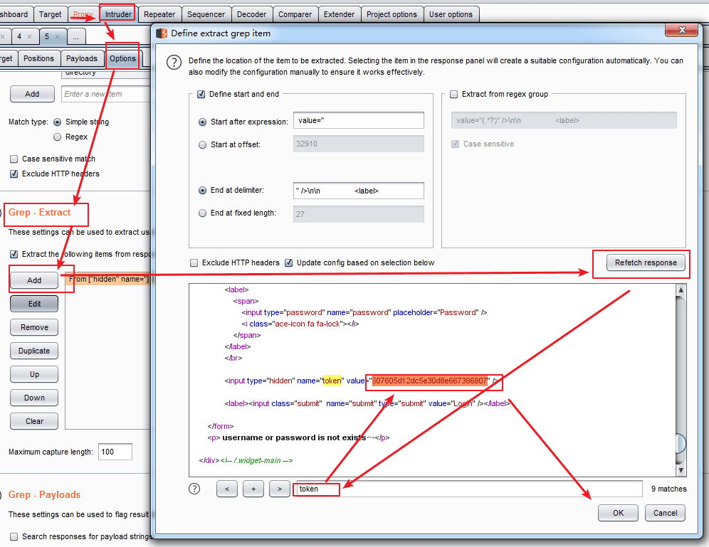
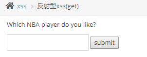
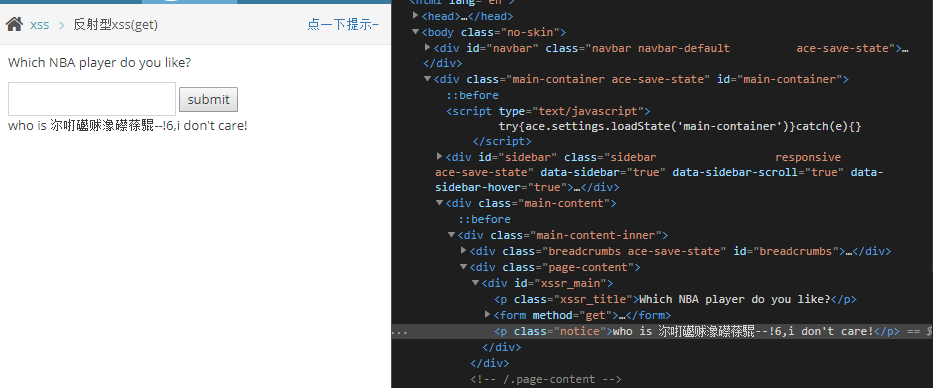
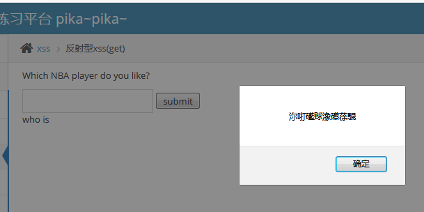

# [pikachu](https://github.com/zhuifengshaonianhanlu/pikachu)

## 前言

优秀的 web 基础靶场,与 dvwa 相比 dvwa 更适合教学，pikachu 漏洞种类更多，建议通关顺序 dvwa --> pikachu

---

## 实验环境
- phpstudy ：http://phpstudy.php.cn/
- Microsoft Windows 10 企业版 LTSC - 10.0.17763
- VMware® Workstation 15 Pro - 15.0.0 build-10134415
- kali 4.19.0-kali3-amd64

---

## Reference
- [第三周作业 token防爆破 （基于pikachu平台）burp token的暴力破解](https://blog.csdn.net/weixin_43899561/article/details/88780363)
- [第六周作业 1.SQL inject防范措施 2.sqlmap工具使用案例 3.XSS基本概念和原理 4.反射型XSS(get) 5.存储型XSS 6.安装nmap](https://blog.csdn.net/weixin_43899561/article/details/89291896)


---

## 搭建/使用
**windows**
1. 把下载下来的 pikachu 文件夹放到 web 服务器根目录下;
2. 根据实际情况修改 inc/config.inc.php 里面的数据库连接配置;
3. 访问 http://x.x.x.x/pikachu ,会有一个红色的热情提示"欢迎使用,pikachu 还没有初始化，点击进行初始化安装!",点击即可完成安装

---

## Burte Force
“暴力破解”是一攻击具手段，在web攻击中，一般会使用这种手段对应用系统的认证信息进行获取。 其过程就是使用大量的认证信息在认证接口进行尝试登录，直到得到正确的结果。 为了提高效率，暴力破解一般会使用带有字典的工具来进行自动化操作。

理论上来说，大多数系统都是可以被暴力破解的，只要攻击者有足够强大的计算能力和时间，所以断定一个系统是否存在暴力破解漏洞，其条件也不是绝对的。 我们说一个web应用系统存在暴力破解漏洞，一般是指该web应用系统没有采用或者采用了比较弱的认证安全策略，导致其被暴力破解的“可能性”变的比较高。 这里的认证安全策略, 包括：
1. 是否要求用户设置复杂的密码；
2. 是否每次认证都使用安全的验证码（想想你买火车票时输的验证码～）或者手机otp；
3. 是否对尝试登录的行为进行判断和限制（如：连续5次错误登录，进行账号锁定或IP地址锁定等）；
4. 是否采用了双因素认证；

...等等。千万不要小看暴力破解漏洞,往往这种简单粗暴的攻击方式带来的效果是超出预期的!

### 基于表单的暴力破解
**服务器端核心代码**
```php
//典型的问题,没有验证码,没有其他控制措施,可以暴力破解
if(isset($_POST['submit']) && $_POST['username'] && $_POST['password']){

    $username = $_POST['username'];
    $password = $_POST['password'];
    $sql = "select * from users where username=? and password=md5(?)";
    $line_pre = $link->prepare($sql);

    $line_pre->bind_param('ss',$username,$password);

    if($line_pre->execute()){
        $line_pre->store_result();
        if($line_pre->num_rows>0){
            $html.= '<p> login success</p>';

        } else{
            $html.= '<p> username or password is not exists～</p>';
        }

    } else{
        $html.= '<p>执行错误:'.$line_pre->errno.'错误信息:'.$line_pre->error.'</p>';
    }

}
```

**利用爆破 burpsuite**

略

### 验证码绕过(on server)
**服务器端核心代码**
```php
$html="";
if(isset($_POST['submit'])) {
    if (empty($_POST['username'])) {
        $html .= "<p class='notice'>用户名不能为空</p>";
    } else {
        if (empty($_POST['password'])) {
            $html .= "<p class='notice'>密码不能为空</p>";
        } else {
            if (empty($_POST['vcode'])) {
                $html .= "<p class='notice'>验证码不能为空哦！</p>";
            } else {
//              验证验证码是否正确
                if (strtolower($_POST['vcode']) != strtolower($_SESSION['vcode'])) {
                    $html .= "<p class='notice'>验证码输入错误哦！</p>";
                    //应该在验证完成后,销毁该$_SESSION['vcode']
                }else{

                    $username = $_POST['username'];
                    $password = $_POST['password'];
                    $vcode = $_POST['vcode'];

                    $sql = "select * from users where username=? and password=md5(?)";
                    $line_pre = $link->prepare($sql);

                    $line_pre->bind_param('ss',$username,$password);

                    if($line_pre->execute()){
                        $line_pre->store_result();
                        //虽然前面做了为空判断,但最后,却没有验证验证码!!!
                        if($line_pre->num_rows()==1){
                            $html.='<p> login success</p>';
                        }else{
                            $html.= '<p> username or password is not exists～</p>';
                        }
                    }
                    else{
                        $html.= '<p>执行错误:'.$line_pre->errno.'错误信息:'.$line_pre->error.'</p>';
                    }
                }
            }
        }
    }
}
```
服务器端只检查了一次验证码，而后未将验证码过期处理，一直有效，可验证一次重复爆破

**利用爆破 burpsuite**

抓个验证码输入正确的请求，就可以重复爆破了


### 验证码绕过(on client)
**服务器端核心代码**
```php
if(isset($_POST['submit'])){
    if($_POST['username'] && $_POST['password']) {
        $username = $_POST['username'];
        $password = $_POST['password'];
        $sql = "select * from users where username=? and password=md5(?)";
        $line_pre = $link->prepare($sql);


        $line_pre->bind_param('ss', $username, $password);

        if ($line_pre->execute()) {
            $line_pre->store_result();
            if ($line_pre->num_rows > 0) {
                $html .= '<p> login success</p>';

            } else {
                $html .= '<p> username or password is not exists～</p>';
            }

        } else {
            $html .= '<p>执行错误:' . $line_pre->errno . '错误信息:' . $line_pre->error . '</p>';
        }

    }else{
        $html .= '<p> please input username and password～</p>';
    }
}
```

**客户端端核心代码**
```html
<script language="javascript" type="text/javascript">
    var code; //在全局 定义验证码
    function createCode() {
        code = "";
        var codeLength = 5;//验证码的长度
        var checkCode = document.getElementById("checkCode");
        var selectChar = new Array(0, 1, 2, 3, 4, 5, 6, 7, 8, 9,'A','B','C','D','E','F','G','H','I','J','K','L','M','N','O','P','Q','R','S','T','U','V','W','X','Y','Z');//所有候选组成验证码的字符，当然也可以用中文的

        for (var i = 0; i < codeLength; i++) {
            var charIndex = Math.floor(Math.random() * 36);
            code += selectChar[charIndex];
        }
        //alert(code);
        if (checkCode) {
            checkCode.className = "code";
            checkCode.value = code;
        }
    }

    function validate() {
        var inputCode = document.querySelector('#bf_client .vcode').value;
        if (inputCode.length <= 0) {
            alert("请输入验证码！");
            return false;
        } else if (inputCode != code) {
            alert("验证码输入错误！");
            createCode();//刷新验证码
            return false;
        }
        else {
            return true;
        }
    }


    createCode();
</script>
```
客户端做验证码验证，服务器端无验证

**利用爆破 burpsuite**

抓个正确的包,把验证码部分直接去掉就可以继续爆破了

### token防爆破?
**服务器端核心代码**
```php
if(isset($_POST['submit']) && $_POST['username'] && $_POST['password'] && $_POST['token']==$_SESSION['token']){

    $username = $_POST['username'];
    $password = $_POST['password'];
    $sql = "select * from users where username=? and password=md5(?)";
    $line_pre = $link->prepare($sql);


    $line_pre->bind_param('ss',$username,$password);

    if($line_pre->execute()){
        $line_pre->store_result();
        if($line_pre->num_rows>0){
            $html.= '<p> login success</p>';

        } else{
            $html.= '<p> username or password is not exists～</p>';
        }

    } else{
        $html.= '<p>执行错误:'.$line_pre->errno.'错误信息:'.$line_pre->error.'</p>';
    }

}

//生成token
set_token();
```

**什么是token**

简单的说 token 是由服务端生成的一串字符串，作为客户端向服务端请求的一个标识。在前端使用用户名/密码向服务端发送请求认证，服务端认证成功，那么在服务端会返回 token 给前端，前端在每次请求时会带上服务端发来的 token 来证明自己的合法性。

**利用爆破 burpsuite**

抓个正确的包,将以下两个设置为变量


在 Option 中的 Grep Extract 中点击 Add，在点击 Refetch response，找到返回的包，找到来自服务器返回的 token，为了便于查找可以在最下方的输入栏输入 token 直接找到 token 的值



选中 token 的值，复制，同时在选中状态下点击确定，同时在 Option 中的最下方勾选 always，并将线程设置为 1 ,如果不将线程设为1会出现报错

接下来设置 Payloads，对密码的 Payloads 直接导入字典。


对 token 的 Payloads 的参数设置为 Recursive grep，同时在 Payload Options 选中第一项，并将之前复制的 token 值输入到下面的输入栏中。点击攻击。


后面略

---

## XSS
Cross-Site Scripting 简称为“CSS”，为避免与前端叠成样式表的缩写"CSS"冲突，故又称 XSS。一般XSS可以分为如下几种常见类型：
1. 反射性XSS;
2. 存储型XSS;
3. DOM型XSS;

XSS 漏洞一直被评估为 web 漏洞中危害较大的漏洞，在 OWASP TOP10 的排名中一直属于前三的江湖地位。
XSS 是一种发生在前端浏览器端的漏洞，所以其危害的对象也是前端用户。
形成 XSS 漏洞的主要原因是程序对输入和输出没有做合适的处理，导致“精心构造”的字符输出在前端时被浏览器当作有效代码解析执行从而产生危害。
因此在 XSS 漏洞的防范上，一般会采用“对输入进行过滤”和“输出进行转义”的方式进行处理:
1. 输入过滤：对输入进行过滤，不允许可能导致 XSS 攻击的字符输入;
2. 输出转义：根据输出点的位置对输出到前端的内容进行适当转义;

**跨站脚本漏洞简单的测试流程**
1. 在目标站点上找到输入点,比如查询接口,留言板等;
2. 输入一组"特殊字符+唯一识别字符",点击提交后,查看返回的源码,是否有做对应的处理;
3. 通过搜索定位到唯一字符,结合唯一字符前后语法确认是否可以构造执行js的条件(构造闭合);提交构造的脚本代码,看是否可以成功执行,如果成功执行则说明存在XSS漏洞;

### 反射型xss(get)


**服务器端核心代码**
```php
if(isset($_GET['submit'])){
    if(empty($_GET['message'])){
        $html.="<p class='notice'>输入'kobe'试试-_-</p>";
    }else{
        if($_GET['message']=='kobe'){
            $html.="<p class='notice'>愿你和{$_GET['message']}一样，永远年轻，永远热血沸腾！</p>";
        }else{
            $html.="<p class='notice'>who is {$_GET['message']},i don't care!</p>";
        }
    }
}
```

按流程来，为了找到输入点，先提交一组特殊字符+唯一识别字符，再去查看源代码



下图说明输入的字符被直接输入到了这个 P 标签中，这里就存在一个输出点

F12 修改前端数量限制，输入 payload `<script>alert('沵咑礷赇潒礤蒣騉')</script>` 点击提交



刷新一次后就不会进行弹窗，说这仅仅是一次性。

### 反射性xss(post)
给爷整懵了这里，我还以为要在登录框xss呢？原来是要登录进去再输入payload

**服务器端核心代码**
```php
if(isset($_POST['submit'])){
    if(empty($_POST['message'])){
        $html.="<p class='notice'>输入'kobe'试试-_-</p>";
    }else{

        //下面直接将前端输入的参数原封不动的输出了,出现xss
        if($_POST['message']=='kobe'){
            $html.="<p class='notice'>愿你和{$_POST['message']}一样，永远年轻，永远热血沸腾！</p>";
        }else{
            $html.="<p class='notice'>who is {$_POST['message']},i don't care!</p>";
        }
    }
}
```

和上面 get 型一样，这里不需要 F12 修改输入限制，输入 payload `<script>alert('沵咑礷赇潒礤蒣騉')</script>` 点击提交

### 存储型xss
**服务器端核心代码**
```php
if(array_key_exists("message",$_POST) && $_POST['message']!=null){
    $message=escape($link, $_POST['message']);
    $query="insert into message(content,time) values('$message',now())";
    $result=execute($link, $query);
    if(mysqli_affected_rows($link)!=1){
        $html.="<p>数据库出现异常，提交失败！</p>";
    }
}

if(array_key_exists('id', $_GET) && is_numeric($_GET['id'])){

    //彩蛋:虽然这是个存储型xss的页面,但这里有个delete的sql注入
    $query="delete from message where id={$_GET['id']}";
    $result=execute($link, $query);
    if(mysqli_affected_rows($link)==1){
        echo "<script type='text/javascript'>document.location.href='xss_stored.php'</script>";
    }else{
        $html.="<p id='op_notice'>删除失败,请重试并检查数据库是否还好!</p>";

    }

}
```

同之前的思路，先输入一组特殊字符+唯一识别字符，查看源代码，能发现输出点和反射性 XSS 是相同的。


输入 payload `<script>alert('老铁，欧里给!')</script>` 点击提交

再刷新一次，还是会返回设置的 payload 中输入的内容，说明会将插入的内容会被存到数据库中，会造成持续性的攻击。再源代码里也能看到被插入进的 payload。

### DOM型xss
**服务器端核心代码**
```php
if ($SELF_PAGE = "xss_dom.php"){
    $ACTIVE = array('','','','','','','','active open','','','','','active','','','','','','','','','','','','','','','','','','','','','','','','','','','','','','','','','','','','','','','','','','','','','','','','','','','','','','','','','','','','','','','','','','','','','','','','','','','','','','','','','','','','','','','','','','','','','','','','','','','','','','','','','','','','','','','','','','','','','','','','','','','','','','','','','','','','','','','','','','','','','','','','','','','','','','','','','','','','','','','','','','');
}

$PIKA_ROOT_DIR =  "../../";
include_once $PIKA_ROOT_DIR.'header.php';

include_once $PIKA_ROOT_DIR."inc/config.inc.php";
include_once $PIKA_ROOT_DIR."inc/mysql.inc.php";


if(isset($_GET['text'])){
    $haha = "这里是后台的处理逻辑";
}
```

**什么是 DOM**
DOM 全称是 Document Object Model，也就是文档对象模型。我们可以将 DOM 理解为，一个与系统平台和编程语言无关的接口，程序和脚本可以通过这个接口动态地访问和修改文档内容、结构和样式。当创建好一个页面并加载到浏览器时，DOM 就悄然而生，它会把网页文档转换为一个文档对象，主要功能是处理网页内容。故可以使用 Javascript 语言来操作 DOM 以达到网页的目的。

**什么是 DOM 型 XSS**
首先 DOM 型 XSS 其实是一种特殊类型的反射型 XSS，它是基于 DOM 文档对象模型的一种漏洞。
在网站页面中有许多页面的元素，当页面到达浏览器时浏览器会为页面创建一个顶级的 Document
object 文档对象，接着生成各个子文档对象，每个页面元素对应一个文档对象，每个文档对象包含属性、方法和事件。可以通过 JS 脚本对文档对象进行编辑从而修改页面的元素。也就是说，客户端的脚本程序可以通过 DOM 来动态修改页面内容，从客户端获取 DOM 中的数据并在本地执行。基于这个特性，就可以利用 JS 脚本来实现 XSS 漏洞的利用


https://blog.csdn.net/weixin_43899561/article/details/89429726
https://blog.csdn.net/weixin_43899561?t=1
https://blog.csdn.net/qq_44696653?t=1


---

## CSRF


---

## Sql Inject


---

## RCE


---


